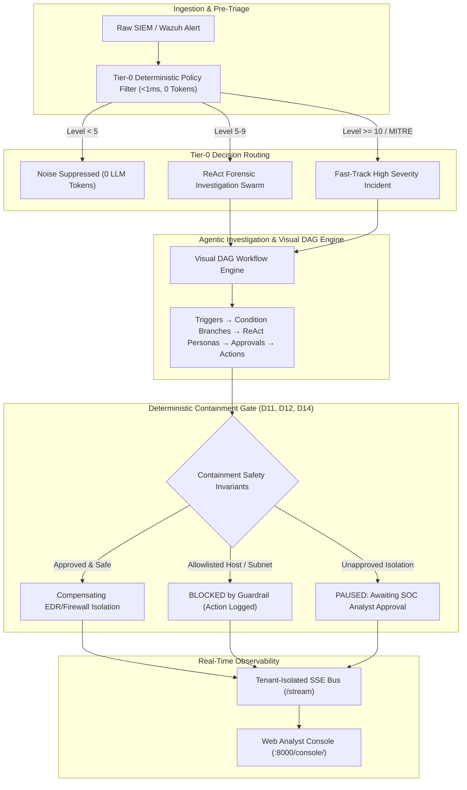
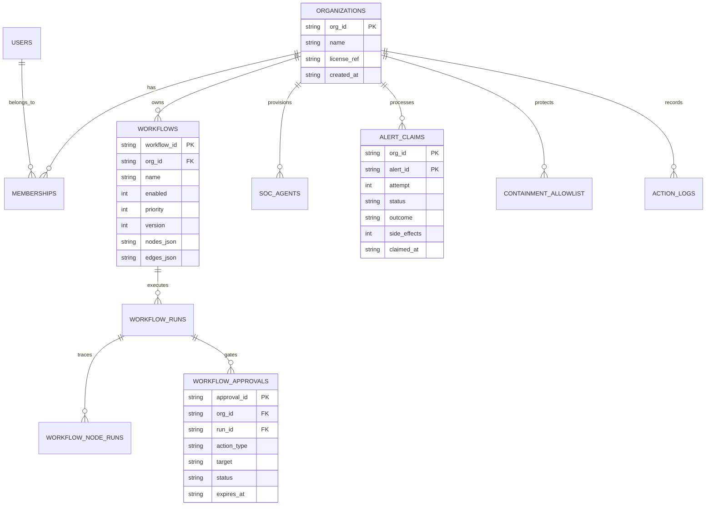

# TERMINUS — System Architecture & Technical Specification
## Enterprise Autonomous AI Security Operations & SOAR Engine

---

## 1. Architectural Philosophy: The Dual-Engine Model

Modern Security Operations Centers face a fundamental tension:
1. **Rule-based SIEM systems** are fast and deterministic but brittle, unable to perform nuanced lateral movement analysis or synthesize multi-source evidence.
2. **Pure LLM architectures** provide reasoning but suffer from latency (2–15s), prohibitive token costs on raw event floods (\$10k+/month for 50k alerts/day), non-deterministic hallucination, and vulnerable prompt injection vectors.

**TERMINUS** resolves this dichotomy through a **Dual-Engine Architecture**:



---

## 2. Core Subsystems & Layered Architecture

### A. Telemetry Ingestion & Connection Sensor (`terminus.service`, `terminus.server`)
- **Ingestion Routes**: `POST /wazuh`, `POST /alert`, `POST /webhook/wazuh`, `POST /webhook/alert`.
- **Real-Time Sensor (`ServiceConnectionSensor`)**: Tracks active external telemetry feeds, heartbeats, and alert frequencies.
- **Dynamic Baseline Auto-Configuration**: On boot or new tenant onboarding, auto-provisions baseline agent personas, DAG playbooks, and critical containment allowlists.

### B. Tier-0 Deterministic Policy Engine (`terminus.policies`)
- Evaluates rules in $<1\text{ms}$ with 0 token spend.
- Tiers alerts into:
  - `IGNORE` (Level $<5$): Dropped or recorded as noise without LLM overhead.
  - `TRIAGE` (Level $5–9$): Escalated to ReAct agents for deep investigation.
  - `ESCALATE` (Level $\ge 10$ or recognized MITRE ATT&CK technique): Fast-tracked to critical containment playbooks.

### C. ReAct Forensic Investigation Swarms (`terminus.agent`)
- Specialized personas operating in structured ReAct loops:
  - **Triage Sentinel**: Fast MITRE ATT&CK tagging and pre-filtering.
  - **Forensic Investigator**: Deep process tree inspection, IOC correlation, and PowerShell payload deobfuscation.
  - **Containment Operator**: Formulates targeted boundary response plans.
- **Toolbelt Integration**: Parameterized tools (`siem_search`, `threat_intel_lookup`, `powershell_deobfuscator`) with SQL parameterization and injection sanitization.

### D. Visual DAG Workflow Engine (`terminus.pipeline`)
- Graph-based playbook execution with strict node schemas (`extra="forbid"`):
  - **Triggers**: Alert webhooks, cron timers.
  - **Conditions**: Severity thresholds, JSONPath comparisons, human approvals.
  - **Agents**: Dynamic persona invocation.
  - **Actions**: Slack webhooks, Twilio SMS, Jira tickets, host isolation, firewall blocks.
- **Execution Semantics**:
  - **Resolved-Edge Joins (D9)**: Join nodes fire when all incoming non-skipped paths complete.
  - **Non-Raising Engine (D6)**: Errors are caught, formatted into execution traces, and routed to `on_error` handles.
  - **Idempotent Claim Leases (D5, D24)**: Atomic claims in SQLite prevent double-execution, while a 60-second background sweeper reclaims interrupted jobs.

### E. Blast-Radius Safety Architecture (`terminus.containment`)
- **Deterministic Containment Gating (D11)**: All paths to destructive tools (`tool_isolate`, `tool_firewall`) MUST pass through an approval condition or severity gate ($\ge 1$).
- **Immutable Organizational Allowlists (D12)**: Protected hosts (e.g. `dc01.corp.internal`, `dc02.corp.internal`) and critical subnets (`10.0.0.0/24`) cannot be isolated automatically by LLM output.
- **Admin Force Override (D14)**: Manual bypass requires administrative credentials, non-LLM origin, and can never isolate protected IPs or invalid targets.

### F. Multi-Tenant SaaS & Cryptographic Licensing (`terminus.auth`, `terminus.licensing`, `terminus.orgs`)
- **Tenant Isolation (D10)**: All storage queries and SSE broadcasts are strictly partitioned by `OrgId`.
- **Cryptographic License Tokens**: HMAC-SHA256 signed tokens encoding tier entitlements (`COMMUNITY`, `PRO`, `ENTERPRISE`), seat limits, and expiration dates.
- **Timing-Safe Authentication**: PBKDF2-HMAC-SHA256 password hashing with constant-time verification.

---

## 3. Database Schema & Concurrency Model

TERMINUS uses SQLite configured with **Write-Ahead Logging (WAL)** and `PRAGMA busy_timeout = 5000` for high-throughput concurrent multi-tenant execution:



---

## 4. Real-Time Observability & Frontend Architecture

The **Web Analyst Console** (`web/` compiled to `src/terminus/server/static/console/`) is built on React 18, Vite, and Ant Design:

- **Analyst Workbench**: Dynamic alert queues, instant triage buttons, and MITRE matrix visualization.
- **Interactive Force-Directed Graph**: 7-day visual canvas correlating attacker IPs, lateral movements, and affected workstations.
- **Visual DAG Studio**: Node-edge drag-and-drop playbook designer with auto-layout computation (D19) and dry-run execution (D23).
- **Incident Copilot**: Multi-turn forensic assistant with scoped tool execution (`list_incidents`, `correlate_sources`, `search_incidents`).
- **Autonomous Actions Log**: Immutable audit ledger recording every autonomous agent decision, workflow trace, and guardrail block.

---

## 5. Verification & Test Architecture

TERMINUS maintains a **133-test automated verification suite** across 20 specialized test modules:

```
tests/
├── test_adapters.py             # Wazuh / SIEM JSON schema parsing & normalization
├── test_auth.py                 # Timing-safe auth, PBKDF2 hashing & session tokens
├── test_containment_quota.py    # Fleet-wide dual sliding-window quota & lease TTLs
├── test_copilot_tools.py        # Copilot forensic tools & tenant isolation
├── test_e2e_enterprise.py       # Full SaaS lifecycle (Orgs, RBAC, Webhooks, Actions)
├── test_investigation_graph.py  # Force-directed topology graph persistence & scoping
├── test_investigator.py         # ReAct agent reasoning with scripted & cloud LLMs
├── test_licensing.py            # HMAC-SHA256 license token minting & tampering checks
├── test_models.py               # Pydantic value objects & validation
├── test_orgs.py                 # Multi-tenant organization isolation & seat limits
├── test_policies.py             # Sub-millisecond Tier-0 policy engine rules
├── test_reports.py              # 24-hour daily summary report generators
├── test_rule_synthesizer.py     # Dynamic Sigma/YARA synthesis & Wilson score metrics
├── test_server.py               # FastAPI REST endpoints & SSE streaming bus
├── test_terminus_enterprise.py  # Guardrails, deobfuscator, IOC extractor, stitcher
└── workflows/
    ├── test_phase0.py           # Database WAL pragmas, schemas, secret redactor
    ├── test_phase1.py           # DAG schemas, handles, containment gating (D1, D11, D12)
    ├── test_phase2.py           # Multi-tenant agent & workflow REST API
    ├── test_phase3.py           # Persona prompt interpolation & ReAct execution (D17)
    ├── test_phase4.py           # DAG engine, joins, branching, error routing (D6, D9)
    ├── test_phase5.py           # Idempotent claims, lease recovery, sweeper (D5, D24)
    ├── test_phase6.py           # Optimistic concurrency, auto-layout, dry-run (D18, D19)
    └── test_phase8_e2e.py       # Complete E2E workflow lifecycles & approval gates
```

All 133 tests execute synchronously via:
```bash
uv run pytest -q
```
