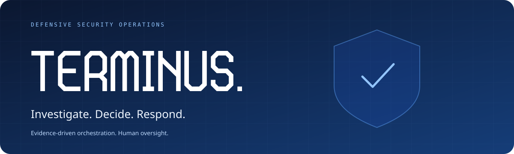
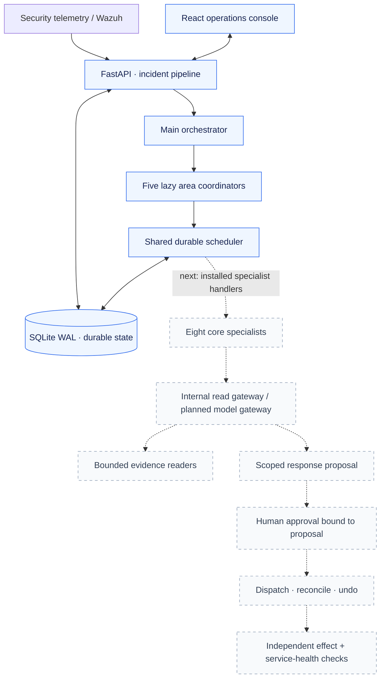

<div align="center">



**An AI security operations workspace built around evidence, controlled orchestration and human oversight.**

[](pyproject.toml)
[](src/terminus/server/)
[](web/)
[](docs/DATABASE_STATUS.md)
[](docs/MVP_RELEASE.md)

[**Get started**](#run-terminus) &nbsp; · &nbsp; [**Architecture**](#how-it-fits-together) &nbsp; · &nbsp; [**Release plan**](docs/MVP_RELEASE.md) &nbsp; · &nbsp; [**Team checklist**](docs/EXECUTION_CHECKLIST.md)

<sub>Defensive security operations</sub>

</div>

---

## Security operations, with a clear line of sight

Terminus brings incidents, investigation, agents, response workflows and asset inventory into one analyst workspace. Its direction is simple: turn security telemetry into traceable findings, route work to the right specialists, and require scoped approval and independent verification for consequential responses.

The repository includes the operations console, incident and identity persistence, visual playbooks, a durable scheduler and deterministic main/area coordination. The toolkit catalog defines the next integration layer; live specialist handlers and verified lab defense remain release work.

| Investigate | Coordinate | Respond |
| :--- | :--- | :--- |
| Incident queues, Copilot investigation surfaces and source-linked evidence records. | Durable tasks, tracked runs, bounded scheduling and five logical areas. | Visual playbooks and guardrails, with approval-bound live response planned. |

## Release at a glance

| Layer | Current state |
| :--- | :--- |
| **Analyst console** | Overview, incidents, Copilot, reports, agents, workflows, organization and settings surfaces. |
| **Asset inventory** | Organization-scoped repositories, containers, clouds, VMs, domains and devices. Registration does not establish monitoring or protection. |
| **Persistent foundation** | SQLite-backed identities, sessions, incidents, workflows, tasks, runs and immutable evidence. Daily report history and campaign stitching still use process memory. |
| **Durable scheduling** | Dedicated Python/asyncio process, fenced leases, bounded concurrency, cancellation, retry and conservative holds after uncertain dispatch. |
| **Coordination** | Main orchestrator, lazy area coordinators and eight core role definitions. Real specialist execution handlers are pending. |
| **Defensive toolkit** | **60 specialties · 18 families · 93 tools · 48 connector candidates.** Contracts plus an internal read-only registry/gateway, durable invocation quota/audit and fenced evidence writer. Five bounded investigation readers are available through explicit internal installation; live lab and specialist integration remain pending. |
| **Model control** | Named multi-provider/local connections, encrypted API credentials and masked authenticated configuration API. Provider protocols are fixture-tested; production transport, role/data policy, routing and durable financial budgets remain planned. |
| **Live defense** | Wazuh-backed approved response, reconciliation, expiry/undo and independent verification require implementation and lab testing. |

> **Verification snapshot:** 670 automated tests passed against a temporary SQLite database on October 4, 2026, including 100 provider-protocol checks, 53 model-connection checks, and reader/context/toolkit checks. This verifies repository behavior and contracts. Live SIEM, model-provider and defense demonstrations require separate evidence.

## How it fits together



Solid connections show the current foundation; dotted connections show pending specialist/model/response integration. The API and scheduler run as separate processes on the same host and SQLite file. Scheduler completion alone never proves that an endpoint is protected.

[Scheduler operations](docs/SCHEDULER.md) · [Coordination contracts](docs/COORDINATION.md) · [Architecture decisions](docs/ARCHITECTURE_DECISIONS.md)

## Eight specialists for the first release

| Role | Responsibility |
| :--- | :--- |
| **Triage** | Prioritize alerts, reduce duplicates and scope the incident. |
| **Identity** | Investigate authentication, accounts and privilege activity. |
| **Endpoint** | Examine host, process, file and persistence evidence. |
| **Network** | Correlate connections and network observations. |
| **Application & API** | Investigate application requests and related host activity. |
| **Response planner** | Propose scoped actions, prerequisites and expected impact. |
| **Verification** | Independently check effects, recovery and legitimate service health. |
| **Evidence & reporting** | Assemble cited findings, timelines and incident reports. |

These are core role definitions, not a claim that eight live handlers are installed. Planning is separate from dispatch. The broader [60-specialty roadmap](docs/FUTURE_SCOPE.md) remains **planned and unavailable in 1.0**.

## Run Terminus

### Local development

Install Python 3.12+ and [uv](https://docs.astral.sh/uv/), then run from the repository root:

```powershell
uv sync --frozen
Copy-Item .env.example .env
# Edit .env for the integrations you intend to use.
uv run --frozen uvicorn terminus.server.app:create_app --factory --host 127.0.0.1 --port 8000
```

Open **http://127.0.0.1:8000/console/**. The prebuilt console is tracked, so an initial launch needs no frontend build.

Local mode supports the first-run demo login: `admin@terminus.local` / `Password123!`. Existing credentials are not reset at startup. Hosted mode creates no demo account.

### Windows evaluation

1. Run `TerminusSetupWizard.exe` or `setup_terminus.bat` for setup.
2. Run `run_demo_service.bat` to launch the service and open the console.
3. Optionally run `launch_attack_simulation.bat` to submit **synthetic attack telemetry**.

The setup executable configures the project; it does not bundle the full service. The simulation submits demonstration events, rather than executing ransomware or proving real defense. Existing provider-connected paths may make model calls when configured.

[Evaluation walkthrough](docs/GRADING_GUIDE.md) · [Build instructions](docs/BUILD.md)

### Configuration and storage

Use [.env.example](.env.example) for current settings. The runtime uses Python `sqlite3` and local `terminus.db`; PostgreSQL, MySQL, MongoDB and Redis are not active storage backends. A database URL entered in the setup wizard does not switch the runtime backend.

For hosting, configure `TERMINUS_DEPLOYMENT_MODE=hosted`, a stable `TERMINUS_LICENSE_SECRET` and HTTPS. Optional first-run owner bootstrap uses the paired `TERMINUS_BOOTSTRAP_ADMIN_EMAIL` and `TERMINUS_BOOTSTRAP_ADMIN_PASSWORD` settings. Preserve the database on persistent storage and use SQLite's backup API for live backups.

[Database and deployment details](docs/DATABASE_STATUS.md)

<details>
<summary><strong>Working on the console?</strong></summary>

From `web/`, install the locked dependencies and rebuild the tracked console assets:

```powershell
cd web
npm ci
npm run build
```

Include updated generated files in `src/terminus/server/static/console/` with frontend changes.

</details>

## Build toward a real defense demonstration

1. **Tool foundation:** internal registry, gateway, evidence writer and invocation audit implemented; wire trusted context and verified adapters next.
2. **Evidence collection:** bounded incident, coverage, endpoint and authentication readers; explicit gaps when telemetry is missing.
3. **Model policy:** credentials, provider/local-model support, data-sharing rules and budget enforcement.
4. **Specialist execution:** real handlers, workflow identities and observable task/tool activity.
5. **Scenario A:** real alert → investigation → approved temporary block → independent verification → undo.
6. **Scenario B and deployment:** instrument the selected application, prove the second scenario locally, then reproduce deployment on AWS.

The local lab comes first. Cloud deployment, SYN-flood extensions and the future native Watcher have their own acceptance gates. Follow the [shared checklist](docs/EXECUTION_CHECKLIST.md): claim a task before starting, and mark it **Done by** only after its required checks pass.

## Verify changes

Run the suite with a disposable database selected **before test collection**:

```powershell
uv run --frozen python -c "import tempfile,pathlib,pytest; from terminus.storage.db import Database; Database.reset_instance(str(pathlib.Path(tempfile.mkdtemp(prefix='terminus-tests-'))/'tests.db')); raise SystemExit(pytest.main(['-q']))"
```

For toolkit contract work:

```powershell
uv run --frozen pytest -q tests/test_toolkit_contracts.py
uv run --frozen ruff check src/terminus/toolkit tests/test_toolkit_contracts.py
```

Fixtures verify contracts and repository behavior; they do not establish live connector readiness.

## Find your way around

```text
TERMINUS/
├── src/terminus/
│   ├── agent/           Existing investigation implementation
│   ├── orchestration/  Durable storage, scheduler and coordination
│   ├── toolkit/        Typed contracts and declarative tool catalogs
│   ├── pipeline/       Workflow graph and execution machinery
│   ├── containment/    Guardrails and current containment paths
│   ├── server/         FastAPI routes and prebuilt console
│   └── storage/        SQLite database and repositories
├── web/                React / TypeScript console source
├── tests/              Automated checks and recorded fixtures
├── docs/               Release scope, architecture and team runbooks
└── scripts/            Setup, demonstration and supporting utilities
```

| Start here | What it answers |
| :--- | :--- |
| [Product requirements](docs/PRD.md) | What are we building, and which rules govern it? |
| [1.0 release scope](docs/MVP_RELEASE.md) | What must work for the first release? |
| [Team execution checklist](docs/EXECUTION_CHECKLIST.md) | What remains, who claimed it, and what proves completion? |
| [Toolkit contracts](docs/TOOLKIT_CONTRACTS.md) | Which tools, permissions and evidence does each specialty need? |
| [Future scope](docs/FUTURE_SCOPE.md) | How does the defensive catalog expand beyond 1.0? |
| [Architecture decisions](docs/ARCHITECTURE_DECISIONS.md) | What is implemented, and where are the remaining gaps? |

---

<div align="center">

**TERMINUS** · Evidence before conclusions. Approval before consequential action. Verification before success.

</div>
