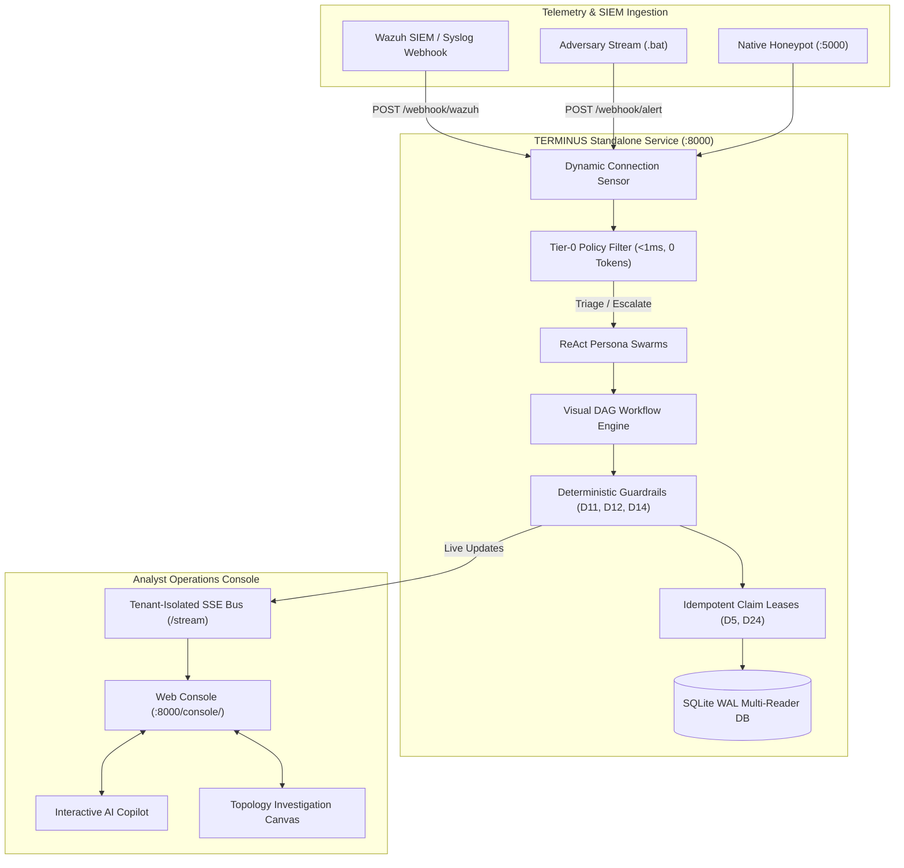

# TERMINUS — Autonomous AI Security Operations & SOAR Platform

[](https://www.python.org/downloads/)
[](https://fastapi.tiangolo.com)
[](https://docs.pytest.org/)
[](LICENSE)
[](ARCHITECTURE.md)

**TERMINUS** is an enterprise-grade, multi-tenant Autonomous AI Security Operations Center (AI SOC) and SOAR platform built as an independent, deterministic service layer on top of SIEM telemetry (e.g., Wazuh, Syslog). It pairs a deterministic, sub-millisecond policy engine with specialized ReAct AI investigation agents, visual DAG automation playbooks with mandatory human-in-the-loop approval gates, and deterministic blast-radius containment guardrails.

---

## Key Capabilities

- **Deterministic Tier-0 Noise Filter**: Sub-millisecond pre-filtering (<1ms) evaluating rules before invoking LLMs. Filters 70–85% of benign noise at **0 token cost**.
- **ReAct AI Forensic Investigator Swarms**: Multi-turn reasoning swarms (*Triage Sentinel*, *Forensic Investigator*, *Containment Operator*) equipped with parameterized forensic tools (`siem_search`, `threat_intel_lookup`, `powershell_deobfuscator`).
- **Visual DAG Workflow Engine**: Validated graph-based playbooks with strict node schemas (`extra="forbid"`), resolved-edge join semantics (D9), and non-raising execution safety (D6).
- **Deterministic Blast-Radius Containment (D11, D12, D14)**: Mathematically enforces that critical infrastructure (Domain Controllers, core subnets, and default gateways) cannot be isolated by probabilistic AI hallucination.
- **Fleet-Wide Dual Containment Quota**: Sliding-window rate limiter enforcing a maximum of 10 global host isolations and 3 per subnet per 15-minute window with automated lease TTL expiration.
- **Dynamic Sigma & YARA Rule Synthesizer**: Closed-loop detection engineering that drafts validated Sigma and YARA rules from investigated incidents.
- **Wilson Score Statistical Backtesting**: Evaluates historical detection telemetry with 95% Wilson confidence lower bounds ($w^-$) to eliminate false-positive overfitting.
- **Idempotent Claim Leases & Concurrency (D5, D24)**: Atomic SQLite WAL claims with 60-second background lease sweepers and crash recovery.
- **Real-Time Tenant-Isolated SSE Stream**: Server-Sent Events bus streaming live incident investigations, agent thought steps, and approval requests to the UI.
- **Interactive SOC Analyst Console**: React 19 / Vite / Ant Design workspace featuring dynamic incident queues, force-directed graph canvas, ReAct Copilot, and visual DAG designer.
- **Asset Inventory**: Organization-scoped SQLite records for repositories, containers, cloud accounts, virtual machines, domains, and devices. Admins can register and remove inventory records; monitoring coverage is explicitly shown as not connected until collectors/providers are implemented.

---

## 3-Step Windows Quickstart (Grading Walkthrough)

TERMINUS is packaged for turnkey evaluation without requiring pre-installed Node.js or complex database setup:

The prebuilt console is tracked in `src/terminus/server/static/console/` so evaluators can launch the service without a frontend build. After changing frontend source, run `npm ci` and `npm run build` from `web/` and include the updated generated assets. The setup executables configure the service; they do not bundle the full service and console.

The current runtime uses SQLite, with automatic migration of legacy agent and workflow keys. Authentication, organizations, memberships, sessions, and report history still use process memory. See [Database status](docs/DATABASE_STATUS.md) for persistence and setup configuration limitations. Live containment requires an implemented response connector; the current demo supports simulation and guardrail evaluation.

### 1. Setup & Configuration Wizard
Double-click `TerminusSetupWizard.exe` (or run `setup_terminus.bat`):
* Interactive pre-flight checks: live port collision scanning (Port `8000`) and live "Test LLM Connection" probe.
* Configures service daemon port, SQLite WAL database (`terminus.db`), and AI reasoning backend (Groq / OpenAI / Ollama / vLLM).
* Provisions the root administrator (`admin@terminus.local` / `Password123!`), generates cryptographic enterprise license tokens, and exports `docs/wazuh_integration.xml`.

### 2. Start the Standalone Service Daemon
Double-click `run_demo_service.bat`:
* Boots the FastAPI backend service on `http://localhost:8000`.
* Auto-provisions baseline agent fleet personas, DAG playbooks, and containment allowlists.
* Automatically opens the Web Operations Console: **[http://localhost:8000/console/](http://localhost:8000/console/)**.

### 3. Stream Live Multi-Stage Cyberattacks
In a second terminal window, double-click `launch_attack_simulation.bat`:
* Streams realistic adversary attack waves against the running service:
  1. **Wave 1 — Reconnaissance & Brute Force**: Demonstrates sub-millisecond Tier-0 noise suppression (0 token spend).
  2. **Wave 2 — LockBit 3.0 Ransomware Detonation**: Triggers ReAct forensic investigation and pauses for **Mandatory Human Approval** before host isolation.
  3. **Wave 3 — Active Directory Mimikatz DCSync Attack**: Demonstrates deterministic guardrails **blocking** unauthorized isolation of Domain Controller `dc01.corp.internal`.
  4. **Wave 4 — AI Copilot Campaign Correlation**: Correlates multi-host adversary behavior across the MITRE ATT&CK matrix.

### Platform Reset & Teardown
To reset the database or clean the environment, run `uninstall_terminus.bat`:
* **Soft Reset**: Cleans database state, test artifacts, and logs while preserving the virtual environment.
* **Full Teardown**: Gracefully terminates services and completely cleans virtual environments and build artifacts.

---

## System Architecture



---

## 24 Pinned Architectural Decisions (`D1`–`D24`)

| Decision | Implementation Guarantee | Test Suite |
| :--- | :--- | :--- |
| **D1** | Strict node schemas (`extra="forbid"`) preventing payload injection. | `tests/workflows/test_phase1.py` |
| **D2** | Deterministic workflow execution priority (`ORDER BY priority ASC, created_at ASC`). | `tests/workflows/test_phase5.py` |
| **D3** | Base investigation commits before visual workflow triggers execute. | `tests/workflows/test_phase5.py` |
| **D4** | Workflows default to disabled draft state upon creation. | `tests/workflows/test_phase6.py` |
| **D5** | Atomic alert claims with idempotent leases and safe crash reclaim. | `tests/workflows/test_phase5.py` |
| **D6** | Non-raising workflow engine mapping errors to `on_error` branches. | `tests/workflows/test_phase4.py` |
| **D7** | Clean architectural separation of run `Status` vs `Outcome`. | `tests/workflows/test_phase0.py` |
| **D8** | Visual handles schema mapped deterministically (`default`, `true_case`, `false_case`, `on_error`). | `tests/workflows/test_phase1.py` |
| **D9** | Resolved-edge join semantics: joins fire when all incoming non-skipped paths complete. | `tests/workflows/test_phase4.py` |
| **D10** | Strict multi-tenant isolation keyed by `OrgId` across all repositories. | `tests/test_server.py` |
| **D11** | Deterministic containment gating: isolation MUST pass condition or human approval. | `tests/workflows/test_phase1.py` |
| **D12** | Immutable organizational allowlists protect Domain Controllers and core subnets. | `tests/workflows/test_phase1.py` |
| **D13** | Secret redactor scrubs API keys, passwords, and tokens from all telemetry. | `tests/workflows/test_phase0.py` |
| **D14** | `force_override` requires admin role, non-LLM origin, and never bypasses invalid IPs. | `tests/workflows/test_phase1.py` |
| **D15** | Approval timeouts resolve to `EXPIRED` (`system:expired`) and resume workflow. | `tests/workflows/test_phase5.py` |
| **D16** | Shielded timeout execution wrappers prevent orphaned external side-effects. | `tests/workflows/test_phase4.py` |
| **D17** | ReAct forensic agent swarms operate with scoped toolbelts and prompt interpolation. | `tests/workflows/test_phase3.py` |
| **D18** | Optimistic concurrency control via integer version incrementing. | `tests/workflows/test_phase6.py` |
| **D19** | Dynamic auto-layout engine computes clean visual node coordinates. | `tests/workflows/test_phase6.py` |
| **D20** | Gap-filling ticketing and notifications when custom playbooks omit them. | `tests/workflows/test_phase5.py` |
| **D21** | Structural workflow edits force state transition to disabled for analyst re-validation. | `tests/workflows/test_phase6.py` |
| **D22** | Metadata updates preserve active enabled/disabled workflow status. | `tests/workflows/test_phase6.py` |
| **D23** | Interactive dry-run testing executes full graph evaluation with zero side-effects. | `tests/workflows/test_phase4.py` |
| **D24** | 60-second autonomous background sweeper recovers stale runs and expires approvals. | `tests/workflows/test_phase5.py` |

---

## Automated Test Harness & Verification

TERMINUS is backed by a 100% automated test suite covering all 8 development phases:

```bash
# Run full automated test suite (149 tests)
uv run pytest -q

# Run with verbose output and duration analysis
uv run pytest -v --durations=10
```

---

## Directory Structure

```
terminus/
├── TerminusSetupWizard.exe  # Standalone Windows GUI Setup & Installation Wizard
├── setup_terminus.bat       # Interactive CLI Setup & Environment Builder
├── run_demo_service.bat     # Launches the Standalone Autonomous SOC Service Daemon
├── launch_attack_simulation.bat # Live Multi-Stage Adversary Attack Telemetry Streamer
├── uninstall_terminus.bat   # Interactive Platform Uninstaller & Reset Tool
├── src/terminus/            # Core Python Platform Package
│   ├── agent/               # ReAct Forensic Investigation Swarms & Scoped Tools
│   ├── auth/                # Session Tokens & Timing-Safe Password Hashing
│   ├── containment/         # Deterministic Blast-Radius Safety Guardrails & Quotas (D11, D12)
│   ├── core/                # Value Objects, Typed IDs, and Base Exceptions
│   ├── licensing/           # Cryptographic HMAC-SHA256 Licensing Token Engine
│   ├── llm/                 # OpenAI/Groq/vLLM LLM Client & Strict JSON Parser
│   ├── notifiers/           # Slack Webhooks, Twilio SMS, and Log Notifier Fan-out
│   ├── orgs/                # Multi-Tenant SaaS Organization & Seat Management
│   ├── pipeline/            # Visual DAG Engine, Node Registry & Background Sweeper
│   ├── policies/            # Sub-Millisecond Tier-0 Policy Rules Engine
│   ├── privacy/             # Automated Secret & Sensitive Token Redactor (D13)
│   ├── server/              # FastAPI Application, SSE Streaming Bus & Routers
│   ├── service/             # Telemetry Connection Sensor & Baseline Auto-Config
│   ├── storage/             # SQLite WAL Repositories (Claims, Runs, Workflows, Logs)
│   └── tuning/              # Dynamic Sigma/YARA Rule Synthesizer & Wilson Score Backtesting
├── docs/                    # Architectural Specifications & Evaluation Guides
│   ├── GRADING_GUIDE.md     # 5-Minute Evaluation Walkthrough for Graders
│   └── wazuh_integration.xml # Auto-generated Wazuh Integration XML Block
├── scripts/                 # Setup, Flood Simulation & Verification Utilities
├── tests/                   # 149 Unit, Concurrency, and E2E Workflow Test Suites
│   └── workflows/           # Phases 0-8 Comprehensive Verification Suites
├── web/                     # React 19 + Vite + Ant Design Analyst Console Source
├── pyproject.toml           # Tooling & Dependency Configuration
├── ARCHITECTURE.md          # Complete Engineering Architecture Specification
└── README.md                # Platform Documentation & Overview
```

---

## Evaluation Reference

For grading and live evaluation instructions, see **[docs/GRADING_GUIDE.md](docs/GRADING_GUIDE.md)**.
