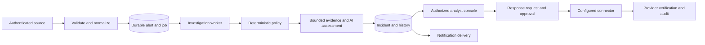

# Terminus delivery plan

Planning date: October 2, 2026. Status: proposed working baseline for PM review.

## 1. Delivery objective

Deliver a repeatable demonstration in which an authorized analyst receives a security alert, follows its investigation, reviews evidence and an AI assessment, sees an incident and notification, and records a response decision. Then harden that same workflow for a limited operational pilot.

The user confirmed this is a class project and wants both local and hosted operation, with AWS as a possible host. The demo deadline, specific audience/rubric, team capacity, and available Wazuh/LLM credentials are pending. Sequence below is dependency-based; no calendar commitments are implied.

### Class-project deployment recommendation

Build one Linux container image and Docker Compose configuration, exercised locally through Docker Desktop and on a single AWS Linux instance. Recommend a Lightsail virtual server for straightforward hosting; choose EC2 instead if the course's AWS lab or credits require it. Do not provision resources until account access, permitted services, and a budget are established.

For this release, use a single application process and a mounted persistent SQLite data directory with a tested backup/restore procedure. Add a reverse proxy with HTTPS for hosted access, environment-specific secrets, configured administrator credentials, and a narrow firewall. Keep the database private. Keep Opposer and the vulnerable lab/honeypot on the local lab network. Use fixture replay on AWS and optionally connect an authenticated lab Wazuh source; the replay is clearly labeled.

Use scripted assessments for a fully offline, repeatable local demonstration, with explicit provenance. Offer a separate local-model or remote-model configuration for demonstrating AI inference. Do not silently switch modes when a provider fails. A local GPU model is optional and is not assumed to fit the small hosted server.

Acceptance adds: the same application version passes the demo scenarios locally and on AWS; hosted login uses configured credentials; data survives application/container restart; HTTPS works; no lab attack service is publicly exposed; backup/restore is rehearsed; hosting cost and teardown are documented. AWS hosting is a class demonstration environment, not an enterprise readiness claim.

AWS references: [Lightsail overview](https://docs.aws.amazon.com/lightsail/latest/userguide/), [static IP](https://docs.aws.amazon.com/lightsail/latest/userguide/lightsail-create-static-ip.html), and [instance snapshots](https://docs.aws.amazon.com/lightsail/latest/userguide/lightsail-how-to-create-a-snapshot-of-your-instance.html). A static IP keeps the instance address stable across stop/start; snapshots support instance backup but do not replace a tested application database backup.

## 2. Evidence and documentation authority

On October 2, `uv run --frozen pytest -q` passed: 65 tests in 5.03 seconds. This establishes the current automated test result, not operational readiness. No live-provider or browser rehearsal was performed for this plan.

Selected implementation findings:

- Updated October 2: `containment/active_response.py` and live workflow containment now refuse execution when no provider exists, returning explicit unconfigured/not-executed results. Dry runs are labelled simulations. Actual host isolation, firewall blocking, and IAM revocation remain future connector work.
- `ingestion/buffer.py` holds work in an in-memory queue. Accepted work needs a persistence/recovery contract before a dependable pilot.
- `server/deps.py` constructs SQLite repositories alongside in-memory user, organization, session, and ticket services. Trace actual read/write paths before claiming restart persistence.
- Default administration is bootstrapped with fixed credentials. Restrict this to an explicit local demo mode and require configured credentials elsewhere.
- The September enterprise plan contains useful release gates, but its historical claim that SQLite is absent is superseded by current code. Revalidate its other findings.

Use this document for delivery scope and gates; create a concise PRD for product behavior and acceptance criteria, and architecture decision records (ADRs) for technical choices. Keep DESIGN.md as historical MVP context and DESIGN_AND_BUILD_v2.md as an aspirational feature source until individual requirements are accepted. ENTERPRISE_UPDATE_PLAN.md remains the detailed hardening backlog; reconcile it with current evidence rather than duplicating every task here.

Track every capability as proposed, implemented, verified locally, or verified against a live provider. File existence and green unit tests alone do not establish delivery.

## 3. Release scope

| Capability | D1: demonstration | P1: limited pilot | Later |
| --- | --- | --- | --- |
| Wazuh-compatible ingestion | Authenticated fixture replay; one lab Wazuh path if available | Durable authenticated ingestion and recovery | Additional SIEMs |
| Investigation | Policy, bounded evidence collection, validated verdict | Retry, timeout, provenance, usage controls | Sandbox and learned memory |
| Incident workflow | List/detail, evidence, status, analyst decision | Durable history, filtering, audit | Advanced attack graphs |
| Identity | Login, logout, tenant scope, role checks | Session expiry/revocation and tenant isolation evidence | OIDC/SSO as required |
| Storage | SQLite for supported local topology; restart proof | Transactional inbox/outbox and migration/recovery proof | PostgreSQL when deployment requires it |
| Notifications | Log delivery; one external channel if credentials exist | Durable delivery state and retries | More connectors |
| Response | Recommendations and approval history; clearly marked simulation | One approved, verified lab connector | More EDR/IAM/firewall integrations |
| UI | Coherent investigation journey, local assets, truthful states | Operational failure and recovery views | Fleet/workflow builders after execution works |
| Packaging | Documented clean startup, seed/reset, demo scripts | Supported deployment, backup/restore, monitoring | Scale-specific infrastructure |

A recorded approval is not proof of an executed action. A scripted verdict is labeled as scripted; a live/local model result includes its provider provenance. Demo and live modes must never silently substitute for one another.

## 4. Architecture baseline to ratify

Prefer a modular monolith retaining Python/FastAPI and current adapter seams. Separate domain logic, application orchestration, HTTP/UI boundaries, and provider/storage adapters. Avoid adding services or rewriting the frontend merely to make the architecture look larger.

Target flow:

Required contracts:

1. Tenant identity comes from validated credentials and membership, not a trusted client-supplied organization ID alone. Source credentials and human sessions have distinct scopes.
2. Choose one authoritative repository per resource. API, worker, UI, and reporting use the same committed records. Test/demo memory adapters are explicitly configured.
3. Acknowledge queued ingestion only after durable storage. Expose queued, investigating, completed, and failed states; retries are bounded and idempotent. Do not claim this behavior until implemented.
4. Persist evidence references, policy/prompt/model versions, timestamps, verdict, and error states. AI output proposes actions; deterministic authorization controls execution.
5. Default consequential response to human approval. Store request, decision, execution attempt, provider acknowledgement, and verified result separately. Do not adopt automatic temporary isolation from the v2 blueprint for D1.
6. Notification failure does not erase a completed investigation. Record delivery status and allow controlled retry.
7. Keep UI assets local for the offline path. Treat alert text and model output as untrusted display content.

For D1, a single process with SQLite can keep deployment simple. If queued ingestion is exposed, work still needs durable recovery. For P1, choose a worker topology and database based on the actual hosting/concurrency requirement. Start with a SQL-backed job mechanism if it satisfies measured needs; a broker is a separate ADR, not an automatic demo dependency.

## 5. Ordered work packages

| Package | Deliverable | Suggested accountable role | Exit evidence |
| --- | --- | --- | --- |
| A: baseline and decisions | Capability inventory, route-to-store map, current lint/type results, PRD and ADRs | Technical lead; PM owns scope | Each demo requirement mapped to implementation, gap, and verification |
| B: trustworthy foundation | Auth/tenant checks, explicit modes, safe user responses, correct setup, authoritative persistence | Backend lead | Missing/invalid credentials rejected; cross-tenant denial; clean startup and restart tests |
| C: complete incident slice | Alert to policy to evidence/verdict to stored incident and notification | Backend lead | Benign/medium/critical scenarios, malformed alert, duplicate, provider timeout, notification failure |
| D: analyst experience | Login, overview, incident detail, evidence, status changes, response decision, visible failures | Frontend lead | Browser rehearsal verifies every promised control and no untrusted HTML execution |
| E: demo packaging | Seeded lab, configuration template, launcher/runbook, fixture replay, offline assets | QA/demo owner | Fresh installation and three consecutive complete rehearsals |
| F: pilot hardening | Durable jobs/retries, sessions, audit, backups, observability, one live connector | Technical lead | Recovery and isolation evidence plus provider-side verification |

Dependencies: A before architecture-dependent edits; B before shared/live use; C before final UI behavior; C and D before E sign-off; D1 release before claiming P1 readiness. UI design and scenario drafting can proceed alongside B after contracts are agreed.

Each task needs one owner, dependencies, observable acceptance criteria, a linked change, verification evidence, and status. Split work by complete user behavior rather than by creating many disconnected modules.

## 6. Demonstration story and readiness gate

Suggested story: an analyst monitors a small organization's SOC. A benign alert is filtered. A suspicious authentication event creates an incident with evidence and an AI assessment. A critical event escalates visibly. The analyst reviews and records a response decision. Restart the application and show that incidents and decisions remain available. Demonstrate one controlled integration failure and its clear status.

Use deterministic fixtures for repeatable rehearsal and a separately identified live Wazuh/model segment when the environment permits. Opposer/honeypot traffic is a lab demonstration input; it does not establish detection coverage against the represented CVEs.

D1 release checklist:

- Fresh startup follows a documented procedure with validated configuration and no manual database edits.
- Login/logout and role/tenant boundaries work on all demo routes.
- Benign, medium, and critical inputs produce the documented policy outcomes.
- Evidence and verdict provenance are visible; missing information remains visibly missing.
- Incidents and analyst decisions survive restart in the supported topology.
- Duplicate input has an explicit tested outcome; accepted work is not silently lost on restart.
- Model and notification failures are visible and recoverable without fabricated success.
- Simulated response cannot be mistaken for live containment.
- Dashboard runs without required CDN access, browser console errors, or broken advertised controls.
- Relevant tests pass; lint/type findings are recorded and resolved or explicitly scoped with owners. No green readiness claim based solely on the test count.
- Three consecutive rehearsals pass; runbook includes troubleshooting and a labeled offline fallback.

P1 additionally requires verified source credentials, durable execution/recovery, session expiry/revocation, tested tenant isolation, backup/restore, operational health and logs, and independent verification of the first live response connector. Define capacity targets from the intended pilot workload before load testing.

## 7. PM operating rhythm and next decisions

Maintain one backlog and a decision log. Review a working vertical slice at each milestone. Record blockers and scope changes with their effect on the release gate. Freeze feature additions during final rehearsal except fixes required to pass the gate.

Next planning inputs: demo date/audience/environment, team availability and ownership, available provider credentials, and whether live containment is actually required for the demonstration. Once supplied, estimate the work packages, identify the critical path, and assign calendar milestones. Until then, prioritize A through E and keep F as a separate release commitment.
