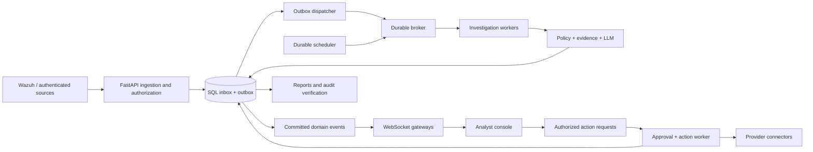

# TERMINUS Enterprise Update Plan

Planning baseline: Git `81e83e7` on `main`, reviewed September 4, 2026.

Status: proposed implementation roadmap. This document authorizes no deployment, vendor-account action, or data deletion. Targets and estimates below are planning assumptions, not measured product capabilities. The supplied Enterprise Hardening & Scaling Implementation Plan is incorporated here with foundational repairs, dependency ordering, and release gates.

## 1. Outcome and delivery strategy

Deliver a dependable, tenant-isolated SOC application that accepts security telemetry durably, investigates it with controlled AI usage, produces evidence-backed incidents, executes authorized response actions through verified integrations, and makes its processing and failures observable to operators.

Preserve Python/FastAPI, the typed domain model, replaceable adapters, and the offline demonstration. Deliver in vertical increments with independently reviewable pull requests. A working connector and its complete authorization, audit, recovery, and UI path are more valuable than many adapters that merely report success.

Release stages:

| Release gate | User-visible outcome | Required phases |
| --- | --- | --- |
| R1: dependable local application | Correct configuration, authenticated dashboard, honest incident behavior, persistent SQLite data | P0–P2 |
| R2: durable multi-tenant pilot | PostgreSQL, queued ingestion, audit, trustworthy reports, tenant-scoped live updates | P0–P5 plus reporting from P9 |
| R3: controlled response pilot | Approved actions, executable workflows, first verified connectors, OIDC | P6–P8 and pilot subset of P9–P10 |
| R4: enterprise release candidate | Remaining connector scope, operational documentation, recovery and capacity evidence, all release checks | All phases |

No release is described as production-grade solely because its unit tests pass. External connector support, throughput, recovery behavior, and access isolation require separate evidence.

## 2. Verified starting point

The existing core pipeline and offline simulation work. The baseline has 47 passing tests, 55 Ruff issues, and 222 basedpyright errors with 43 warnings. These counts are a historical baseline and must be recaptured before implementation.

| Finding | Required resolution |
| --- | --- |
| Missing or invalid sessions fall through tenant checks on incidents/reports/ingestion | Separate human sessions from scoped ingestion credentials; fail closed |
| Agents and workflows use global unauthenticated stores | Authenticate all operations and scope every record to a tenant |
| Setup passes unsupported license arguments and emits incompatible environment keys | Fix wizard, runtime settings, validation, and setup round-trip tests |
| SQLite/PostgreSQL are advertised without storage implementations | Implement repositories, migrations, restart tests, and truthful configuration |
| Schema-valid alerts without `full_log` fail during ticket creation | Declare optional log fields and test minimal/nested real-world alerts |
| Containment only edits a label; workflow runs simulate success | Introduce durable action/workflow runs and provider verification |
| Fleet prompts and status do not control investigations | Bind versioned agent configuration to real worker execution |
| Metrics and intelligence include fixed values | Store timestamps/provenance and compute measurable values; show unavailable otherwise |
| Reports ignore their date window; scheduler calls nonexistent `list_all()` | Windowed queries and a durable, single-claim scheduler |
| Dashboard calls missing `showToast`; inserts untrusted HTML | Repair helpers, safe rendering, and browser-level regression coverage |
| UI loads CDN assets despite offline requirements | Build and serve versioned local assets |
| Jira lacks a functional incident-list implementation | Keep internal incidents authoritative; make Jira an external synchronization adapter |
| User response models include password hashes | Introduce public response DTOs immediately |
| Session expiry and entitlement enforcement are incomplete | Persistent revocation/expiry and explicit operation-level permissions |
| README roles, license tiers, and software license statements disagree | Align documentation with actual behavior; rights holder decides repository license |

Git baseline: 13 linear commits, one local/remote branch (`main`), no tags, and no staged/tracked changes. `docs/APPLICATION_DESCRIPTION.md` is pre-existing untracked user content and must remain untouched unless separately requested.

## 3. Proposed defaults and scope decisions

These defaults let implementation proceed without blocking the plan on optional preferences. Record changes as architecture decision records before dependent implementation.

| Decision | Proposed default | Review point |
| --- | --- | --- |
| Application structure | Modular monolith; separate API, worker, scheduler processes | P2/P3 |
| Storage | SQLite for local single-process use; PostgreSQL for shared or production use | P2 |
| Data access | Async SQLAlchemy with Alembic migrations; retain Pydantic at boundaries | P2 dependency spike |
| Queue | Durable SQL inbox/outbox, RabbitMQ production transport; memory adapter for tests/demo only | P3 benchmark |
| Realtime | Authenticated WebSockets with reconnect/replay and HTTP fallback | P5 |
| Frontend | First extract existing UI into local JS/CSS modules; no mandatory React rewrite | P1/P9 |
| Identity | Generic OIDC authorization-code flow with PKCE; Keycloak test environment | P8 |
| SAML | Deferred compatibility milestone if a customer requires it; not claimed as delivered with OIDC | Post-R3 |
| Audit retention | Proposed 365-day online window, configurable archive, hold support; deletion disabled until a retention policy is explicitly enabled | Before production retention runs |
| Raw telemetry retention | Separate configurable policy, proposed 30-day online window; size/privacy review required | P2/P10 |
| Response authority | Human approval for host isolation, process termination, identity changes, and perimeter changes by default | P6 |
| Initial connector order | Jira, one EDR (CrowdStrike proposed), one IAM provider (Okta proposed); remaining vendors follow the same contracts | P7 account availability |
| AI deployment | Explicit scripted/local/remote modes; scripted only in marked demo/test environments | P1/P4 |
| Deployment | Docker Compose development/pilot packaging; reference Linux production topology | P10 |

Keep advanced attack graphs, malware detonation, learned agent memory, SCIM provisioning, full SAML, and Kubernetes-specific packaging outside the first enterprise release. Preserve extension points and track them separately. This plan does include basic event grouping, policy versioning, data minimization, and operational auditability.

## 4. Target architecture and contracts

The SQL database is the source of truth for accepted telemetry, incidents, run states, and event replay. API acknowledgement follows a successful durable transaction containing an inbox record and dispatch intent. Broker delivery happens asynchronously from the outbox. Temporary broker failure can therefore leave accepted work visibly queued; reject new work with a retryable response once configured capacity or database durability is unavailable.

Use at-least-once delivery with idempotent processing. RabbitMQ publisher confirms and consumer acknowledgements address different parts of delivery; the dispatcher must wait for confirms, and workers must acknowledge only after committing durable processing outcomes. Re-delivery is expected and must not duplicate tickets or actions. See [RabbitMQ acknowledgements](https://www.rabbitmq.com/docs/confirms) and [reliability guidance](https://www.rabbitmq.com/docs/reliability).

Proposed domain records:

| Records | Required fields/invariants |
| --- | --- |
| User, Session, Membership, IdentityLink | Public/private user separation; expiry/revocation; unique issuer+subject; explicit roles |
| IngestionCredential, ConnectorConfig, SecretReference | Tenant binding, scopes, key version, revocation; secret values excluded from responses |
| AlertEnvelope, IngestionJob, OutboxEvent | Tenant+source+source-event identity, raw/normalized versions, receipt time, processing status |
| InvestigationRun, Incident, IncidentEvent | Evidence references, verdict schema, policy/prompt/provider versions, lifecycle timestamps |
| AgentConfig, WorkflowVersion, WorkflowRun, NodeRun | Immutable execution snapshot, tenant binding, run state, bounded execution |
| ActionRequest, Approval, ActionAttempt | Typed target, requested effect, actor, approval expiry, idempotency key, provider operation ID |
| AuditEvent, AuditCheckpoint | Tenant stream, sequence, canonical payload, hash version, previous/current hash |
| Report, ScheduledJob, NotificationDelivery | Window, timezone, calculation version, durable claim/delivery state |

Use UTC timestamps internally and tenant timezone for calendar-day reporting. Distinguish event time from receive time, start time, provider acknowledgement, verified completion, and analyst resolution. Preserve raw alerts under an explicit retention/access policy; do not send every retained field to the LLM.

Tenant-owned tables need tenant-aware foreign keys and uniqueness constraints. PostgreSQL row-level security provides defense in depth, alongside application authorization; use a non-owner application role without `BYPASSRLS`, transaction-local tenant context, and tested background-worker access. Table owners and privileged roles can bypass policies, so role setup is part of the acceptance test. See [PostgreSQL row security](https://www.postgresql.org/docs/current/ddl-rowsecurity.html).

API transition:

| Interface | Target behavior |
| --- | --- |
| `POST /wazuh` | Authenticated source; `202` with job ID after durable acceptance; duplicate submission returns the existing job |
| `GET /ingestions/{id}` | Authorized processing state, incident reference, safe error detail |
| `GET /incidents` and detail | Tenant-authorized, paginated/filterable typed responses |
| `POST /incidents/{id}/action` | Creates an action request; never claims containment merely because a request was recorded |
| `POST /actions/{id}/approve` / reject | Explicit permission, request version, decision actor, expiry checks |
| `POST /workflows/{id}/execute` | Creates a durable run; explicit dry-run or live mode |
| `GET /runs/{id}` | Node-level progress and partial failures |
| `/connectors` and connection test | Tenant-admin configuration; safe read-only health check |
| `/audit` / verification / export | Permission-scoped, cursor-paginated evidence and verification results |
| `/ws` and `/events` | Authorized tenant stream and cursor-based replay/recovery |
| `/health/live`, `/health/ready` | Process liveness versus ability to meet acceptance guarantees |

Publish a versioned API/schema contract before changing `/wazuh` from a completed investigation response to `202`. Update all bundled clients in the same release; provide a documented, time-limited compatibility path only if an identified external client requires it.

## 5. Phased implementation backlog

### P0 — Establish the executable baseline

Dependencies: none. Suggested owner: technical lead with QA.

Deliverables:

- Recapture Git state, test/lint/typecheck results, API schema, Python/lockfile versions, and browser failures.
- Add regression tests for invalid/missing authentication, cross-tenant IDs, minimal alerts, report boundaries, setup defaults, and password-hash serialization.
- Add CI for locked installs, pytest, Ruff, basedpyright, and wheel build. Make new code clean immediately; eliminate the existing findings through P1/P2 before R1, rather than disabling checks globally.
- Establish fixture factories and isolated application state; forbid real network integrations in default tests.
- Create ADRs for persistence, ingestion acknowledgement, frontend packaging, auth, and action authority.

Gate: failures are reproducible; each is linked to a phase; no unrelated edits or automatic dependency upgrades.

### P1 — Repair correctness and close access gaps

Dependencies: P0. Suggested owner: backend and frontend maintainers.

Deliverables:

- Split `get_webhook_org` into authenticated human tenant resolution and scoped source-credential authentication. Remove invalid-token fallthrough and implicit production tenant selection.
- Require authorization on incidents, actions, reports, agents, workflows, and future streams. Scope agent/workflow stores while SQL work follows. Deny viewer mutations; admin manages membership/connectors/policy. Treat active-response approval as a separate permission.
- Add public user DTOs, valid email error mapping, input limits, explicit action enums, and safe not-found/conflict responses. Sessions gain defined expiry and revocation semantics.
- Make `full_log` optional, normalize MITRE string/list inputs, validate alert levels, and replace blanket `T*` escalation with documented, versioned rules and explicit technique overrides.
- Standardize `TERMINUS_` settings; repair the wizard's license call, bootstrap flow, provider selection, port handling, and Wazuh manager URL versus ingestion destination distinction. Preserve existing config unless the operator explicitly selects replacement; mask secret input/output.
- Validate generated configuration with the same runtime schema before saving. Remove sample personal notification destinations and hardcoded shared developer signing secrets from defaults. Persistent secrets are required in production mode.
- Repair dashboard helpers and unsafe rendering, remove baked-in demo credentials, add login/logout and organization selection. Demo population becomes explicit and clearly labeled. Disable unsupported live-action controls pending P6/P7.
- Replace fabricated numbers and intelligence verdicts with measured data or unavailable status. Repair report window filtering and current scheduler failure pending durable scheduling in P4.
- Fix public license endpoint return shape, invalid/expired license behavior, and operation-level entitlement policy. Entitlements must never grant authorization that a role lacks.

Gate: missing/invalid sessions return 401; unauthorized tenants/roles fail without data leakage; schema-valid alerts no longer 500; wizard-to-startup works in a temporary directory; dashboard loads and basic operations have no uncaught JS errors; scripted output is visibly identified. CI findings are resolved by the R1 gate.

### P2 — Persistent storage and application composition

Dependencies: P1 contracts. Suggested owner: backend/database maintainer.

Deliverables:

- Introduce database sessions, repositories, migrations, and transactional units of work. Replace module-global stores with services owned by the app lifespan or worker lifecycle.
- Implement SQLite and PostgreSQL adapters for users, sessions, organizations, licenses, credentials, alerts, incidents, configurations, and reports. Add tables needed for jobs, events, audit, approvals, and runs before dependent phases use them.
- Persist role changes, session revocation, credential rotation, incident updates, and agent/workflow versions. Use optimistic concurrency for analyst edits and workflow saves.
- Keep internal incidents authoritative even when Jira is configured. Build external issue mappings rather than swapping away the local incident store.
- Add tenant constraints/indexes, PostgreSQL RLS, bounded queries, cursor pagination, and migration tests for populated databases. Establish connection-pool budgets across API and workers.
- Create an explicit bootstrap command for initial admin/org credentials. No default production login. Add export/import tooling for any existing in-memory data that operators need to retain before restarting.
- Add encrypted secret references with key IDs, backup/rotation procedure, and separation of encryption keys from database backups. Database URLs containing credentials must be redacted.

Gate: restart retains state; two API processes share correct data; two-tenant negative tests pass against both storage implementations; PostgreSQL constraints/RLS are tested with the actual application role; upgrades and restore rehearsals preserve relationships. SQLite is documented as local, not the high-throughput deployment.

### P3 — Durable ingestion, workers, retries, and backpressure

Dependencies: P2. Suggested owner: backend/platform maintainer.

Deliverables:

- Implement authenticated, bounded normalization and transactional inbox/outbox acceptance. Deduplicate by tenant+source+source event ID, with a documented fallback digest when a source lacks stable identity; conflicting reuse of an ID is surfaced.
- Reject malformed/oversized/unauthorized payloads at the boundary with 4xx. Retain bounded, redacted rejection metadata separately where configured. DLQ contains accepted jobs that cannot be processed, not an unlimited dump of hostile request bodies.
- Implement queue protocol, memory demo adapter, SQL outbox dispatcher, and RabbitMQ transport with durable queues, publisher confirms, manual acknowledgement, bounded prefetch, and deliberate shutdown.
- Add worker leases, stage checkpoints, cancellation/time budgets, finite retries with exponential backoff/jitter, dead-letter records, authorized replay, and poison-message handling. Honor provider rate limits and `Retry-After`.
- Separate ingestion, investigation, notification, and action work so slow providers do not block HTTP workers or unrelated stages. Retrying notification must not create a second incident or rerun containment.
- Enforce global and per-tenant queue/LLM quotas; expose backlog age, pressure, and rejected requests. Define 429/503 responses and retry behavior before resource exhaustion.
- Maintain an idempotency ledger for externally visible effects. A timed-out provider request becomes unknown/pending reconciliation unless repetition is demonstrably safe.

Gate: killing an API/worker/dispatcher at every commit/ack boundary loses no accepted test job; duplicate deliveries create one logical incident; retries terminate; backlog remains bounded; broker downtime and noisy tenants produce honest status; shutdown/restart recovers queued work.

### P4 — Audit, report scheduling, and AI reliability

Dependencies: P2/P3. Suggested owner: backend/security maintainer.

Deliverables:

- Record actor, tenant, target, request/run correlation, action, outcome, timestamps, and redacted metadata for auth changes, configuration, approvals, attempts, results, exports, and retention operations.
- Append per-tenant, versioned audit chains transactionally with corresponding state changes. Serialize appends using a locked stream head/sequence; use deterministic canonical encoding and stable hashes. Bound metadata and exclude passwords, keys, and unnecessary payloads.
- Provide full/range chain verification, checkpoints, verification timestamps, and distinct states for verified/tampered/incomplete/unavailable. Restrict normal database roles from audit UPDATE/DELETE; anchor signed checkpoints outside the primary database and provide retained export storage.
- Design retention around archived, independently verifiable segments and preserved checkpoints; honor holds. Never delete a middle segment and silently recompute history. Hashes alone do not prevent a privileged operator rewriting the database; describe that limitation explicitly.
- Add durable scheduled jobs with unique tenant+schedule+window identity, atomic claiming, catch-up policy, and cancellation. Multiple scheduler processes must not duplicate reports.
- Use tenant-local calendar days for Quick Reports and explicit UTC bounds for rolling 24h reports; define half-open intervals, late events, and report snapshot/revision policy.
- Use recorded lifecycle timestamps for latency metrics. Separate observation lag, investigation latency, containment time, and resolution time; source clock uncertainty and missing fields yield unavailable measurements. State cohort, sample count, and unresolved cases.
- Bind every AI run to its prompt/model/policy/config version. Add structured parsing, bounded repair attempts, timeout handling, token/cost quotas, circuit breakers, and explicit pending/manual-review outcomes.
- Minimize/redact outbound evidence and let tenants prohibit remote inference. Treat alert text and LLM output as untrusted data. LLM recommendations cannot bypass typed tools, approvals, or RBAC; mocked intelligence must never appear as a verified external lookup.

Gate: concurrent audit writes form valid chains; mutation/deletion/reordering is detected; archive verification works; two schedulers produce one report per window; report boundary/DST/late-event tests pass; LLM outages and prompt-injection fixtures cannot trigger unauthorized actions.

### P5 — Authenticated realtime delivery

Dependencies: P2–P4 event contracts. Suggested owner: backend/frontend maintainers.

Deliverables:

- Publish domain events only after SQL commit. Envelope: schema version, event ID, tenant, stream sequence, event type, time, entity ID/version, correlation ID, and minimal payload.
- Use a broker fanout layer to reach every API gateway with subscribed users; a shared competing-consumer queue would send an event to only one gateway and is unsuitable for this fanout. Retain SQL events for replay.
- Support `alert.accepted`, `investigation.started/completed/failed`, `incident.created/updated`, `action.status_changed`, `report.generated`, and `workflow.status_changed`. Emit `incident.contained` only after verified containment.
- Authenticate browser connections via secure same-origin sessions or short-lived single-use connection tickets. Validate Origin, membership, session revocation, subscription changes, payload size, and rate limits; never put long-lived bearer credentials in URLs.
- Build URLs from page origin using `wss` on HTTPS. Add heartbeat, disconnect cleanup, bounded per-client buffers, slow-consumer recovery, jittered reconnect, duplicate suppression, event cursors, and snapshot resync when replay is unavailable.
- Fall back to authenticated incremental HTTP polling during prolonged connection failures and stop fallback polling after recovery. Keep mutations on authorized REST endpoints initially; bidirectional WebSocket messages are subscriptions/acknowledgements/heartbeats.

Gate: two API processes and separate workers deliver the same authorized updates; tenant switching/logout revokes access; reconnect recovers missed events or visibly resyncs; slow browsers do not block workers; UI shows live/reconnecting/polling/stale state.

An in-process connection manager is only a local connection registry, not shared infrastructure: FastAPI documents the single-process limitation of its in-memory example. See [FastAPI WebSockets](https://fastapi.tiangolo.com/advanced/websockets/).

### P6 — Real response actions and workflow execution

Dependencies: P2–P4. P5 enhances visibility but must not be required for safe execution. Suggested owner: backend/security maintainer.

Deliverables:

- Add typed action definitions with target resolution, capability requirements, risk, preconditions, dry-run preview, timeout, idempotency behavior, and available compensation. Validate the target belongs to the authorized tenant's integration inventory.
- Use explicit states: requested, awaiting_approval, approved, queued, running, provider_pending, succeeded, failed, unknown, rejected, expired, cancelled. Request recording and provider acceptance are not verified success.
- Bind approval to an immutable action payload, target, connector/config version, actor, and expiry; revalidate authorization and preconditions immediately before dispatch. Policy decides whether requester and approver must differ. Approval cannot silently survive a changed request.
- Record attempts before dispatch; reconcile provider state after timeouts/restarts. If audit or approval state cannot be committed, do not dispatch new high-impact actions. Continue accepting telemetry when its own durability guarantees remain valid.
- Define compensating operations only where supported. Host unisolation may be reversible; process termination, password reset, or token revocation cannot be generically undone. A lease must not promise restoration that the provider cannot guarantee.
- Implement versioned workflow validation and execution: registered typed nodes, required configuration, tenant/connector permissions, graph validation, bounded branching/iteration, cancellation, per-node retries, and persisted node results. Reject arbitrary code/shell nodes in this release.
- Separate draft, published, disabled, and executing versions. Pausing an agent stops new eligible work; explicitly define the handling of in-flight work. Changes apply to new runs, not silently to existing snapshots.
- Make the canvas run button select dry-run/live and show node progress, approval waits, failed/unknown results, and provider evidence. Scheduled workflows use the durable scheduler.

Gate: retries/worker crashes do not duplicate approved effects; invalid graphs cannot run; paused agents affect real execution; unauthorized users cannot approve or dispatch; partial failures remain visible; no UI route can bypass the action service.

### P7 — Connector SDK and verified vendor implementations

Dependencies: P2 secrets/config, P3 work delivery, P4 audit, P6 actions. Suggested owner: integrations maintainer.

The SDK includes capabilities, typed action schemas, configuration validation, safe health checks, execution, result reconciliation, credential refresh, error classification, and optional compensation. Registry entries describe actual tested capabilities, not broad vendor marketing categories. Runtime discovery uses packaged adapters and explicit configuration; no untrusted dynamic code loading.

Every connection is tenant-scoped. Restrict destination hosts/schemes and handle redirects/DNS safely to prevent SSRF; private endpoints require explicit administrative allowlisting for legitimate self-hosted services. Use TLS verification, bounded timeouts, rate limits, versioned API clients, masked secret fields, and safe diagnostic messages.

| Wave | Adapter | Target capability | Evidence needed before enabled live |
| --- | --- | --- | --- |
| A | Jira | Create/update/link incidents and ingest approved remote changes | Project scopes, field/status mapping, webhook authentication, duplicate/order/loop tests |
| A | CrowdStrike Falcon | Supported host containment/release with status reconciliation | Sandbox host, tenant binding, API permission and license checks |
| A | Okta | Supported user-session revocation; credential reset as a distinct higher-risk action | Test identities, effect/limitations, required scopes, provider-state evidence |
| B | SentinelOne | Supported endpoint quarantine/release | Test agent and management API verification |
| B | Microsoft Entra ID (Azure AD) | Supported session revocation/password operations | Graph permission/role checks and propagation behavior in a test tenant |
| B | ServiceNow | Bidirectional incident synchronization | Instance/table ACLs, field mapping, webhook/polling strategy and conflict policy |
| C | Cloudflare | Scoped IP/rule enforcement appropriate to the configured zone/product | Rule ownership, limits, expiry/removal, verified propagation |
| C | AWS | Separate security-group allow-rule management and suitable firewall/WAF IP-blocking capability | Selected AWS resource, IAM scopes, rule semantics, ownership and reconciliation |

AWS security groups permit allow rules only; do not expose a fictitious deny-IP operation on them. Choose AWS WAF, Network Firewall, or another suitable control for the specific protected traffic. Removing an allow rule is a different action and may affect multiple resources. See [AWS security group rules](https://docs.aws.amazon.com/vpc/latest/userguide/security-group-rules.html).

Process termination is an optional separately verified capability per EDR, not assumed from host-containment support. For bidirectional ITSM sync, record remote IDs/versions, update origin, field ownership, conflict resolution, and reconciliation checkpoints to prevent echo loops and lost updates.

Gate per adapter: offline contract tests, redacted provider fixtures, rate-limit/timeout/revocation tests, and an explicit sandbox integration test. Without account access, mark the adapter implemented-but-unverified and keep live actions disabled. A read-only connection test must never isolate a host or reset credentials.

### P8 — Enterprise identity and administration

Dependencies: P1/P2 authorization and P4 audit. Suggested owner: identity/backend maintainer.

Deliverables:

- Implement OIDC through a maintained library following a compatibility/security dependency spike. Keep provider protocol details behind an adapter and do not hand-roll token cryptography.
- Support discovery, authorization code with PKCE S256, transaction-bound state/nonce, issuer/audience/signature/expiry validation, exact redirect configuration, bounded JWKS refresh, and server-side temporary login state.
- Bind accounts by issuer+subject; do not silently link users by email alone. Tenant enrollment requires configured issuer and explicit invitation/group rules; signed arbitrary role claims must not automatically grant admin.
- Default callback to the configured authorization-code response mode, commonly GET/query. Add POST/form_post only when configured and tested. Avoid an unconditional POST-only callback from the original proposal.
- Support logout/revocation, IdP-enforced MFA policy, member removal, domain/issuer restrictions, and audited emergency local administration with protected recovery credentials.
- Add admin UI for roles, ingestion keys, connector secrets, allowed AI providers, retention policy, and license status. Document that licenses govern features, while authorization independently governs actions.

Gate: Keycloak reference integration plus one customer-relevant IdP sandbox; state/nonce/code replay, wrong issuer/audience, expired/revoked sessions, unsafe account linking, and denied tenant enrollment all tested. SAML remains a separately specified milestone.

The proposed authorization flow follows [OAuth security best current practice, RFC 9700](https://www.rfc-editor.org/info/rfc9700/); Authlib has a documented [Starlette OIDC integration](https://docs.authlib.org/en/v1.6.9/client/starlette.html), with the compatible supported version to be selected and locked during implementation.

### P9 — Complete the analyst experience and trustworthy reporting

Dependencies: incremental delivery from P1 onward; advanced views depend on their backend phases. Suggested owner: frontend/QA.

Deliverables:

- Split dashboard logic into API/session, incidents, metrics, agents, workflow canvas, reports, audit, integrations, and realtime modules. Serve locally built assets with a lockfile and packaged license notices.
- Provide loading, empty, error, permission-denied, stale, partial-result, and offline states. Remove all production auto-seeding and synthetic intelligence/capacity/confidence claims.
- Surface actual source timestamps, evidence/provenance, AI mode/model, analyst edits, action approvals/results, and audit verification scope/time. Avoid presenting no alerts as proof of endpoint health.
- Add paginated/filterable incident/audit/report tables, tenant-aware search, connection status, workflow run inspection, and DLQ visibility for authorized operators.
- Preserve keyboard operation, focus management, accessible labels/contrast, and a usable narrow-screen layout. Use safe DOM rendering and a content security policy compatible with locally bundled assets.
- Add browser tests for login/org switching, ingestion-to-incident, safe rendering of malicious alert text, approval/action results, connector errors, reports, reconnect/fallback, and workflows. Use a fake provider and isolated SQL database.

Gate: no uncaught browser errors, no unauthorized data after org switch, no HTML execution from alert/vendor/LLM data, core UI works without public internet, and measurements agree between UI, API, and independently calculated fixtures.

### P10 — Operability, capacity validation, and release

Dependencies: prior phases appropriate to each release gate. Suggested owner: platform/QA with maintainers.

Deliverables:

- Containerize API, workers, scheduler, and dispatcher; provide Compose profiles for local SQLite demo, PostgreSQL pilot, broker-backed load tests, and reference IdP. Pin supported images/dependencies and create reproducible offline installation artifacts where required.
- Document TLS proxy/WebSocket settings, host/origin restrictions, secret provisioning/rotation, least-privilege service accounts, database/broker storage, backup, and upgrade commands.
- Add structured redacted logs, correlation IDs, operational metrics, and tracing across requests/jobs/actions. Monitor queue age/depth, error/retry/DLQ rate, source freshness, provider latency, worker health, database pool saturation, audit failures, and storage growth.
- Expose distinct readiness/liveness and degraded-state diagnostics. Alert on actionable thresholds with ownership/runbooks; observability must not place raw secrets or unrestricted tenant data in metrics/logs.
- Automate dependency and secret scanning, SBOM generation, image/wheel build verification, PostgreSQL integration tests, and browser checks. Avoid printing discovered secret values; rotate/revoke any confirmed exposed credentials through an agreed operational procedure.
- Exercise backup restoration, broker outage, worker/API death, database outage, stale credentials, expired signing keys, disk pressure, and slow/downstream providers. Verify reconciliation after restoration before resuming queued actions.
- Run a multi-tenant soak and realistic capacity benchmark. Publish hardware, topology, settings, alert mix/size, payload count, provider mode, concurrency, software revisions, percentiles, and failure accounting.
- Publish installation, architecture, API migration, operations, connector support, limitations, recovery, and troubleshooting docs. Reconcile README badges/claims and repository licensing with the rights holder's decision.

Gate: all release requirements below have attached evidence, a named operator can install/restore/upgrade using only the docs, and rollback has been rehearsed.

## 6. Measurement and capacity acceptance

These are proposed initial pilot targets to validate and revise against a declared environment. They are not guarantees for arbitrary hardware or external APIs.

| Measurement | Initial target/test |
| --- | --- |
| Durable API acceptance | p95 below 250 ms and p99 below 1 s at 100 alerts/s for 30 min in the pilot topology |
| Recovery accounting | Every accepted unique alert is completed, pending, or explicitly dead-lettered; zero unexplained losses |
| Isolation/fairness | Ten test tenants; one noisy tenant cannot starve a control tenant beyond the documented queue-age budget |
| Notification freshness | Commit-to-visible p95 below 1 s for connected clients under the pilot workload |
| Socket recovery | Restore stream or show polling/resync state within 30 s after connectivity returns |
| Worker recovery | Recover abandoned leased jobs within 60 s under tested lease settings |
| Investigation latency | Publish deterministic pipeline and real-provider latency separately; use a configurable 60 s initial run budget |
| Burst behavior | 100 concurrent requests is a smoke test; also test capacity limits, sustained overload, and subsequent drain |
| Capacity progression | Measure 100, 1,000, then 10,000 accepted alerts/s only as infrastructure permits; investigate bottlenecks before advancing |
| High-volume claim | 10k EPS requires at least 30 min sustained test plus burst/recovery evidence on a declared topology; ingestion EPS is not LLM investigation EPS |
| Reliability soak | 24 h multi-tenant pilot workload, scheduled jobs, provider failures, disconnects, and memory/storage accounting |
| Backup objective | Proposed pilot RPO <=15 min and RTO <=60 min, conditional on measured WAL/backup/restore setup |

Benchmark data mix must specify ignored/triaged/escalated proportions, duplicates, invalid requests, and LLM latency distributions. Begin with approximately 2 KiB median normalized alerts and explicitly test near the configured request-size limit. Real telemetry characteristics override these assumptions.

Useful sizing checks: `backlog bytes = accepted events/sec × outage seconds × stored bytes/event × measured storage overhead`; `active LLM concurrency ≈ investigation arrival rate × mean provider latency`. At 10k EPS and 2 KiB/event, raw payload alone is roughly 1.8 TB/day before indexes, replicas, and audit records. This is why retention, grouping, storage sizing, and AI quotas precede throughput claims.

A database outage must never produce a false durable-acceptance response. RPO for a catastrophic database loss is a separate guarantee from recovering accepted jobs after a worker crash; document both and reconcile external provider actions after restoration.

## 7. Verification matrix and release checks

| Layer | Mandatory evidence |
| --- | --- |
| Domain/unit | Policy boundaries, normalized alert shapes, lifecycle transitions, report windows, canonical hashes |
| Authorization | Each route and stream with missing/invalid/expired/revoked identity; cross-tenant reads/writes; role and key scopes |
| Persistence | SQLite/PostgreSQL contract tests, uniqueness/concurrency, RLS roles, migration and restart/restore |
| Distributed work | Dispatcher/worker crash points, duplicates, retry exhaustion, DLQ replay, cancellation, provider ambiguity |
| Audit | Concurrent append, mutation/deletion/reordering, checkpoints, holds, archive verification |
| Actions/workflows | Approval expiry/payload change, reauthorization, unsupported tools, bounded graphs, partial failure |
| AI | Invalid JSON, timeouts, budget exhaustion, remote-mode restrictions, malicious evidence, provenance |
| Vendors | Mock/contract tests plus opt-in sandbox tests for each advertised live capability |
| Browser | Core user journeys, safe rendering, no public-CDN dependency, reconnect, accessibility smoke checks |
| Operations | Health/degradation, metrics, alerts, load/soak results, upgrades, backup and rollback runbooks |

Expected commands once implemented: `uv sync --frozen`, `uv run pytest`, `uv run ruff check`, `uv run basedpyright`, `uv build`, and a browser test command documented with its lockfile. Introduce markers for database, broker, browser, load, and live-provider tests. Default developer tests remain offline and never send real notifications or containment requests. CI must run PostgreSQL/broker integration tests at relevant gates rather than accepting a SQLite-only result.

R4 completion checklist:

- [ ] All supported tenant data paths enforce identity and authorization, including background work and WebSockets.
- [ ] Accepted telemetry is durably recorded with bounded retries, idempotency, and visible failures.
- [ ] Real action success requires provider evidence; approvals and unknown outcomes survive restart.
- [ ] Audit chains/checkpoints verify, retention is explicit, and restore is tested.
- [ ] Reports/metrics contain measured data and declared windows/provenance.
- [ ] Each advertised vendor capability has sandbox evidence and a supported-version record.
- [ ] OIDC and session lifecycle negative tests pass.
- [ ] UI works offline for local operation and has no synthetic production data or unsafe rendering.
- [ ] Lint/type/tests/build/browser gates pass; relevant dependency/security findings are resolved or explicitly documented with an owner and expiry.
- [ ] Capacity/recovery claims match measured evidence; installation and upgrade docs are usable.
- [ ] Licensing statements and third-party notices are accurate.

## 8. Git delivery and migration sequence

Use short-lived `codex/` branches from the then-current `main`, one coherent change per PR. Preserve unrelated untracked files. Do not commit secrets, live telemetry, local databases, `.env`, or generated caches; extend ignore rules for new database/runtime artifacts. Generated frontend build artifacts need an explicit tracked-versus-packaged policy.

Suggested PR sequence, split further when review size warrants:

1. `codex/baseline-regressions`: CI, deterministic fixtures, failing behavior inventory.
2. `codex/auth-tenant-boundaries`: credential separation, role checks, public DTOs.
3. `codex/config-and-runtime-fixes`: setup/settings, alert parsing, error mapping, lifecycle fixes.
4. `codex/dashboard-correctness`: login/org selection, safe rendering, helpers, demo isolation.
5. `codex/sql-persistence`: repositories/migrations, bootstrap and persistent sessions.
6. `codex/tenant-database-enforcement`: PostgreSQL constraints/RLS, pagination and concurrency.
7. `codex/durable-ingestion`: inbox/outbox, `202` contract and bundled-client migration.
8. `codex/worker-recovery`: broker, retries, DLQ, quotas, failure-injection tests.
9. `codex/audit-and-scheduling`: chains/checkpoints, durable schedules, report windows.
10. `codex/investigation-reliability`: AI modes/budgets/provenance and measured metrics.
11. `codex/realtime-events`: committed events, fanout/replay and browser fallback.
12. `codex/approved-actions`: action state, approvals, reconciliation and dry-run.
13. `codex/workflow-executor`: versioned runnable graphs and persisted node runs.
14. `codex/connector-sdk`: typed capabilities, secrets, safe health checks, contract harness.
15. Separate PRs for Jira, CrowdStrike, Okta, SentinelOne, Entra, ServiceNow, Cloudflare, AWS.
16. `codex/oidc-administration`: OIDC, tenant enrollment, session/security administration.
17. `codex/analyst-console`: remaining audit/integration/run/operations views and browser tests.
18. `codex/operations-release`: packaging, load/recovery evidence, runbooks and release docs.

Auth/UI and persistence changes must have coordinated intermediate states; do not merge authentication changes that leave the bundled UI permanently using rejected demo credentials. Branch order is a suggested review sequence, not a requirement to postpone all frontend work until the end.

Use expand/migrate/contract schema changes. Deploy readers that tolerate old/new fields before switching writers; migrate and verify data before removing old fields. Pin an immutable workflow/config version per running job. Drain or explicitly migrate old job schema versions before removing worker compatibility.

Before upgrade: snapshot/backup, record schema/app versions, check capacity, pause new high-impact action dispatch, and inventory pending jobs/actions. After upgrade: smoke-test tenant isolation and reconciliation, then enable processing/features in stages. Never replay unknown external action outcomes blindly.

Rollback: turn off new feature paths, preserve inbox/outbox/audit data, restore the prior compatible application only where schema compatibility is proven, and reconcile provider operation IDs before resuming actions. Prefer a forward repair over destructive down-migrations; database restoration requires explicit data-loss/recovery handling. Do not revert by reopening unauthenticated access.

## 9. Estimated effort, dependencies, and risks

Rough engineering effort, including implementation/tests/docs but excluding vendor procurement and independent assurance. Re-estimate after P1/P2; staffing and available test environments are unknown.

| Work | Engineer-weeks |
| --- | --- |
| P0 baseline | 0.5–1 |
| P1 correctness/access | 2–3 |
| P2 persistence | 2–4 |
| P3 durable processing | 2–4 |
| P4 audit/scheduling/AI reliability | 3–5 |
| P5 realtime | 1–2 |
| P6 actions/workflows | 3–5 |
| P7 SDK and full vendor matrix | 6–12 |
| P8 identity/admin | 2–4 |
| P9 remaining frontend/reporting | 2–4 |
| P10 operational validation | 3–5 |
| Total before contingency | 26.5–49 |

These are person-effort estimates, not calendar promises. Add contingency for legacy regressions, vendor permissions, and load-test findings. P5/P8 and some UI/vendor work can proceed concurrently once contracts stabilize; the critical dependency chain is authorization → persistence → durable work/audit → approved execution → verified integrations → release evidence.

| Risk/dependency | Mitigation or decision trigger |
| --- | --- |
| No vendor sandbox/license | Continue SDK/mock work; keep capability unverified/disabled until scoped sandbox access exists |
| Scope exceeds team capacity | Ship R1/R2 first; prioritize one EDR/IAM/ITSM path for R3; preserve remaining vendor backlog |
| SQL outbox or audit stream becomes bottleneck | Measure first; batch/partition independent tenant streams, size indexes/storage, preserve correctness before increasing throughput |
| Provider operation cannot be reversed or observed | Expose limitation, require appropriate approval, use unknown state/reconciliation; do not claim successful rollback |
| Setup/old configuration migration | Recognize legacy keys only through explicit documented migration; reject ambiguous conflicts |
| Existing data exists only in process memory | Export before stopping the old app when retention matters; do not imply retrospective recovery is possible |
| External AI leaks excessive evidence or exhausts budget | Tenant egress policy, minimization, explicit provider mode, quotas, bounded concurrency |
| Audit storage and retention conflict | Separate telemetry/audit policies, archive/checkpoints, holds; enable deletion only after policy review |
| Full UI rewrite delays backend repairs | Extract modules and repair current UI first; revisit framework migration on concrete maintenance evidence |

Review before enabling production operation: deployment footprint/capacity budget, audit and telemetry retention, action approval policy, initial vendor/test accounts, OIDC enrollment policy, and software licensing. These do not block creating the plan or implementing safe local foundations.

## 10. First implementation milestone

Start with P0 and P1 in small PRs, then persistent SQLite/PostgreSQL in P2. The first demonstrable target is: install from the lockfile, run setup, log in, select an organization, send an authenticated alert, inspect an accurately labeled incident, restart without losing it, and verify that another tenant cannot read or modify it.

Attach regression evidence and updated setup documentation to that milestone. Only after this foundation passes should the project add distributed processing and advertise enterprise response capabilities.

## 11. UI overhaul and missing interaction requirements

This inventory is based on the current HTML/JavaScript implementation, not a visual browser walkthrough. Existing tabs are Overview, Incidents, Reports, Agents, Workflows, Wazuh Setup, Policies, Organizations, and a License navigation item. Several visible controls are incomplete: the severity filter has no event handler, the organization creation form has no application submission handler, the License navigation target has no corresponding page, and the displayed analyst/organization/environment status is hardcoded. `showToast` is referenced throughout but undefined. Some real API-backed CRUD is present; its existence must not be confused with execution capability.

### 11.1 Application structure

Proposed navigation groups:

| Group | Destinations | User task |
| --- | --- | --- |
| Investigate | Overview, Incidents, Reports | Identify and work current threats |
| Respond | Approval Inbox, Action Runs, Workflows | Review intended changes and track execution |
| Configure | Sources & Integrations, Agents & Policies | Configure evidence collection and automation |
| Govern | Audit Log, Organization & Access, License & Usage | Manage access and examine accountable activity |
| Operate | Processing Health, Failed Jobs | Recover delayed or failed work; restricted operator access |

Use stable URLs for pages and entity details, browser back/forward support, breadcrumbs where useful, and persistent filter state scoped to the user and tenant. Make the active organization, actual deployment mode, current user, and connection freshness visible in the application shell. Permission-aware navigation improves usability but never substitutes for backend enforcement.

### 11.2 Screen-by-screen changes

| Area | Existing state | Required update | Dependency / priority |
| --- | --- | --- | --- |
| Login and session | No implemented dashboard authentication journey; fixed analyst identity | Local login, SSO entry, logout, session-expired recovery, invitation/bootstrap entry, account menu | P1; SSO in P8; essential |
| Organization selection | Fixed organization profile and incomplete creation form | Working selector/create flow, live membership/role/seats, permission states; clear cached tenant data during switch | P1/P2; essential |
| Overview | Metric cards/charts with synthetic values and static active badges | Measured KPIs with definitions/time window/sample count, actual source freshness, queue delay, investigation failures, pending approvals, drill-through links | P4/P5; essential |
| Incident list | Cards/table, refresh, nonfunctional severity selector | Server-backed search/filter/sort/pagination, severity/status/source/host/time filters, stable URLs, visible pending investigation state | P1–P4; essential |
| Incident detail | Forensic modal with limited evidence and misleading fixed confidence | Durable detail page/drawer with evidence, lifecycle timeline, provenance, related jobs/actions, real re-analysis status, permitted status changes | P4/P6/P9; essential |
| Analyst collaboration | No assignee/comments workflow | Assignment, internal notes, resolution reason and activity history; attachments deferred until storage/scanning policy is designed | P2 schema/API addition; R3 usability |
| Response request | Immediate Isolate/Block/Playbook buttons | Target and connector selection, concrete effect preview, required permission, approval requirement, reason, submit/pending/error states | P6/P7; essential before live response |
| Approval Inbox | Absent | Assigned/pending approvals, requester/target/effect, request version and expiry, approve/reject with reason, conflict/expired handling | P6; essential |
| Action Runs | Absent; label mutation implies success | Requested/approved/running/provider-pending/verified/failed/unknown timeline, attempt details, safe retry/reconcile, supported compensation | P6/P7; essential |
| Sources & Integrations | Wazuh instructions and test alert only | Provider catalog, configured connections, configuration wizard, masked credential replacement, safe test, scopes/capabilities, last success/error, rotate/disable | P2/P7; essential |
| Ingestion status | No job-oriented view | Receipt/job ID, queued/processing/completed/failed state, source last-seen, incident link, safe retry guidance | P3; essential after 202 migration |
| Processing Health / Failed Jobs | Absent | Queue lag, retries, worker/provider health, DLQ reasons, scoped job detail, permission-controlled replay with duplicate warning | P3/P10; essential for operators |
| Agent management | Create, pause, edit prompt; metrics detached from execution | Provider/model, allowed tools, published prompt version, policy binding, budget/concurrency, actual runs and errors, precise pause semantics | P4/P6; essential |
| Workflow editor | Canvas pan/zoom, nodes/config, save and simulated run | Validation panel, typed provider-specific forms, connection selection, drafts/publish, dirty state, version history, dry-run/live distinction, run inspection and approval waits | P6/P7; essential |
| Policy editor | Static rule descriptions | Display actual versioned rules; validated editing, explicit technique overrides, sample-alert preview, publish/change history, approval policy configuration | P1/P4/P6 plus policy CRUD API; R3 |
| Reports | Quick/24h creation, cards, modal, browser print | Window/timezone selection, schedule controls, actual totals/definitions, generation state, snapshot/version, downloadable artifact and scoped export | P4/P9 plus export job API; essential |
| Audit Log | Absent | Cursor-paginated actor/action/target/outcome/time filters, detail drawer, verified range/checkpoint/time, incomplete/tampered states, authorized exports | P4/P9; essential |
| Access administration | Fixed role/seat display | Member list/invites, role changes/removal, ingestion-key lifecycle, SSO enrollment settings, session revocation | P2/P8; essential |
| License & Usage | Navigation points to missing page | Real tier/expiry/seat usage, activation form, feature availability, AI budget consumption and limits; distinguish license limits from permission denial | P1/P8; essential |
| Realtime connection | Static active label | Live/reconnecting/polling/stale indicator, last update, visible resync, duplicate suppression and recoverable failure feedback | P5; essential |

Assignment, notes, invitation delivery, exports, policy publishing, and saved shared views require real domain/API support. They must be added as explicit backlog items with authorization and audit tests rather than implemented as local-only UI state. Invitation links can initially be copied by an admin; automated email delivery is a separate configured notification capability.

### 11.3 Shared UI features currently missing or inconsistent

| Shared feature | Implementation requirement | Acceptance example |
| --- | --- | --- |
| Async feedback | Consistent loading indicators, disabled duplicate-submit buttons, progress, success/error messages, correlation ID when useful | Double-clicking an action creates one request; failed saves retain inputs |
| Empty versus failed versus stale | Distinct screens and recovery actions for each state | Disconnected source never shows a healthy green state because incidents are empty |
| Form behavior | Field-level errors, schema-aware validation, secret masking, pending state, dirty-state navigation guard | Bad node configuration identifies the field and prevents publish |
| Selection and table navigation | Working filters/sort/pagination, clear filters, result counts, stable selection | Changing tenant/time window resets invalid cursors and selection |
| URL state | Shareable incident/run/report links and back/forward navigation | Reloading an incident URL preserves the selected record after authentication |
| Authorization feedback | Hide irrelevant actions or disable with an accurate reason; distinguish unauthenticated, forbidden, unconfigured and unlicensed | A viewer can inspect permitted incidents but cannot request containment |
| High-impact review | Action-specific preview and acknowledgement only where the operation warrants it | Operator sees exact host, provider and effect before submitting isolation |
| Concurrent edits | Entity version checks and reload/compare conflict handling | One user's workflow save cannot silently overwrite another's |
| Recovery and undo | Retry only where safe; explain reconciliation and actual provider-supported compensation | Timed-out containment displays unknown pending reconciliation, not a generic retry button |
| Accessibility | Keyboard controls, visible focus, modal focus trap/return, labels, non-color status cues, readable text | Approval and workflow inspection are usable without right-click or a mouse |
| Layout | Compact incident tables, responsive detail panels, consistent spacing/type/button hierarchy | Large incident queues remain usable without rendering every incident card |
| Notifications | Reliable toast component for immediate feedback; persistent actionable inbox for approvals/failures | A vanished toast is not the only record of a failed action |
| Date/time conventions | Tenant timezone, explicit absolute timestamps with relative hints, consistent date ranges | Report bounds and incident timestamps agree across views |
| Safe display | Text-safe rendering, redacted secret values, controlled exports and copy actions | An alert containing HTML cannot execute in a card, tooltip or modal |

Shared components should include application shell, data table, filter bar, status badge, form field/error summary, toast/banner, detail drawer, approval dialog, event timeline, empty/error state, and confirmation/progress controls. Use semantic colors consistently: severity, operation outcome, and connection health are separate concepts.

Bulk assignment/status changes, saved views and CSV export are useful next increments after single-record authorization/idempotency is correct. Bulk containment requires a separate review of target count, permissions, per-target results, and partial failure; do not add it as a generic table convenience.

### 11.4 UI delivery gates

1. R1: working authentication/org selection, repaired controls, safe rendering, actual incident detail, persistent data, and basic empty/loading/error states.
2. R2: queued-job progress, accurate reports, audit views, integration/source health, realtime/fallback states, search/filter/pagination and durable navigation.
3. R3: response preview/approvals, action/run timelines, typed connector forms, executable workflow UI, SSO/admin and collaboration basics.
4. R4: completed vendor controls, operations recovery screens, robust exports, concurrency handling, accessibility/offline/browser verification and measured large-list performance.

For each new backend state, require an explicit visible UI state and a browser regression test. The completion criterion is that an analyst can tell what happened, what remains pending, whether the data is current, and what they are allowed to do next.
