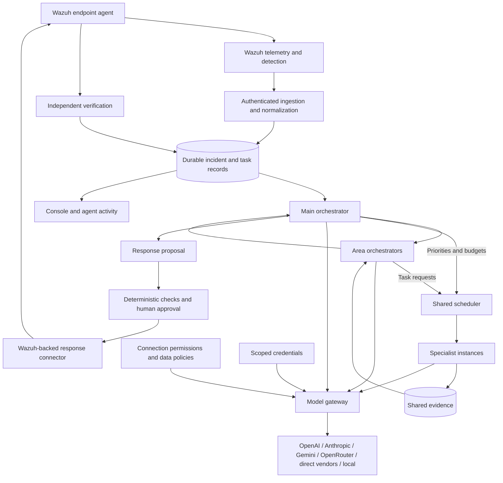

# Terminus product requirements

Version: planning baseline 1.0, October 3, 2026. Product manager: Mohammed. Team: COSC 3370 Team LARP. Source baseline: `ec0a078`. This document defines future behavior; it is not a statement that the requirements are implemented.

## 1. Purpose and release outcome

Terminus coordinates evidence-backed defensive investigations and approved responses. An analyst must be able to see which specialist is working, inspect its evidence, approve a scoped action, and verify what happened on the endpoint.

The first release must demonstrate two real local lab scenarios, then reproduce them in AWS: A, SSH authentication attack with temporary attacker-IP blocking; B, a controlled exploit against a disposable Linux service with observable follow-on activity and a verified scoped response. A bounded SYN-flood demonstration is an extension. Windows Atomic Red Team is optional. A native Terminus Watcher is deferred; Wazuh endpoint agents supply telemetry and execute supported responses.

Presentation date is unconfirmed, expected mid-to-late November 2026 and possibly before November 20. November 10 is the provisional internal readiness target, not an instructor deadline. Confirm the date before fixing calendar commitments.

## 2. Users and operating environments

| User | Need |
| --- | --- |
| Analyst | Follow incidents, evidence, agent activity, approvals, failures, and recovery |
| Administrator | Configure trusted sources, endpoint capabilities, model connections, permissions, and budgets |
| Project manager | Track scope, dependencies, owners, acceptance evidence, and demo readiness |
| Evaluator | Install the delivery, observe actual defense, and distinguish live execution from simulation |

Local development uses a Windows 11 desktop with Ryzen 9 5900X, 32 GB RAM, approximately 2 TB available storage, VirtualBox, and an existing Kali attacker VM. Mohammed owns the local lab and AWS work. Team implementation tasks are up for grabs; teammates and their agents claim tasks and record verified completion using the instructions in `EXECUTION_CHECKLIST.md`. AWS screenshot showed $120 credit remaining and a free-plan end date of December 25, 2026; verify eligibility, current balance, instance availability, and actual credit expiration before provisioning. Hosting is an evaluation deployment, not an enterprise readiness claim.

## 3. Current implementation and gaps

| Capability | Baseline evidence | Release gap |
| --- | --- | --- |
| Console | `web/src/shell.tsx`, `views/workbench.tsx`, `views/workflows.tsx`; blue workspace and original routes retained | Agent-run activity and operator failure/recovery views |
| Incident orchestration | `pipeline/runner.py` invokes investigation, selects first matching workflow, fills notifications, emits events | Durable specialist tasks, area coordination, controlled delegation |
| Playbooks | `pipeline/workflow_engine.py`; conditions, approval states, run records, dry runs | Integration with tracked specialist runs and live response connector |
| AI | `server/deps.py`, `llm/client.py`; one configured OpenAI-compatible connection; scripted fallback when key absent | Multiple connections, role policies, native adapters, routing, budget reservations |
| Evidence | Investigation tools, graph events, claims and incident records; `agent/investigator.py` preserves returned citations; finding-to-immutable-evidence linkage remains pending | Preserve citations through report/storage/UI; stable shared evidence references and per-task provenance |
| Wazuh | `siem/wazuh.py`, webhook routes, normalizers; limited alert/agent client, human-session-based webhook authorization | Dedicated source credentials, usable evidence search, validated manager/indexer API boundaries and real payloads against installed lab version |
| Defense | Guardrails, allowlists, quotas; live containment explicitly returns `not_configured` | Execute, confirm, expire, undo, and independently verify one lab response |
| Storage | SQLite repositories and migrations; see `DATABASE_STATUS.md` | Durable jobs, identity/session paths, evidence, usage, and canonical incident linkage |
| Assets | `server/assets_api.py`, `storage/assets.py`; tenant-scoped manual inventory | Sensor enrollment mapping, last-seen, actual telemetry and action capabilities |
| Packaging | Setup executable, source, lockfile, prebuilt console | Correct setup configuration, clean installation and restart rehearsal |

The source passed 149 tests and a production frontend build in the preceding session. That historical result does not prove live integration or the future architecture. Re-run relevant validation on implemented changes. Audit current call paths rather than equating SQL tables or persona definitions with durable services or independent workers.

Additional audit findings: workflow AI nodes accept an `agent_id` but currently instantiate a generic investigator using persona text, without resolving the configured specialist. Agent statuses/counters and seeded proactive-hunting descriptions are not evidence of actual scheduled work. Webhook source authentication currently depends on human sessions; a SQL `api_keys` table alone does not establish source-key support. Incident live containment endpoints remain unimplemented as well as the workflow response providers.

## 4. Architecture

Retain FastAPI, React, existing policy and workflow seams, and SQLite for the supported single-host lab topology. Introduce a persistent scheduler interface inside the modular application; a separate worker process is permitted if it uses the same supported local database and lifecycle controls. Multiple competing scheduler instances and cross-host SQLite sharing are out of scope. A broker or PostgreSQL requires an explicit decision and migration rationale, not a cosmetic architecture expansion.

The main orchestrator owns objectives, cross-area coordination, and incident closure. Area orchestrators plan and summarize within Alert handling, Investigation, Infrastructure, Applications and data, and Response and improvement. They activate only when relevant. A logical orchestrator need not invoke an LLM for routine bookkeeping. The scheduler alone creates runs and enforces capacity, task ownership, permissions, retries, and cancellation.

Specialists exchange structured findings through shared records. Within-area bounded questions are allowed and visible. Cross-area requests for new work go through the responsible area orchestrators. Evidence notifications may reach subscribers directly. Specialists request peers or other specialties; they cannot recursively create unrestricted workers or expand their privileges.

## 5. Functional requirements

| ID | Requirement and acceptance |
| --- | --- |
| IN-01 | Authenticate telemetry sources, derive tenant scope server-side, validate schema and preserve source event ID, endpoint ID, source IP, timestamps and raw-evidence reference. Invalid and cross-tenant input is rejected. |
| IN-02 | Acknowledge queued acceptance only after durable commit. Duplicate delivery creates no duplicate active investigation or response. Backpressure and rejection are explicit. |
| OR-01 | Persist an incident objective and task tree linking main/area/specialist runs. Only applicable areas activate; UI shows planned versus running work. |
| OR-02 | Claim tasks with leases, heartbeat, timeout, bounded retry and crash recovery. Queue priority and waiting age are observable. Recovery must not repeat an uncertain consequential action. |
| OR-03 | Store help requests with parent task, reason, specialty, scope, expected evidence, budget and status. Scheduler admission creates distinct work or a visible refusal. |
| OR-04 | Combine findings with evidence references and disagreements. An agent summary cannot mark missing evidence as collected or an action as verified. |
| EV-01 | Evidence is tenant/incident-scoped, timestamped, attributable to a tool/source and optionally hashed. Findings cite immutable evidence IDs; sensitive payloads obey retention and access policy. |
| MD-01 | Named connections support multiple credentials for the same provider. Catalog includes OpenAI, Anthropic, Gemini, OpenRouter, direct DeepSeek/OpenAI-compatible vendors, and private/local endpoints. Other native vendor protocols are extensible, not automatically supported. |
| MD-02 | Maintain model capability metadata, including tool use, structured output, context limits and prices where known. Protocol compatibility alone does not prove agent compatibility. Validate each selected model against tool/result schemas. |
| MD-03 | Admin policy grants connections/model pools to organizations and main, area, or specialist roles. Apply task-specific restrictions as a further narrowing. Secrets stay server-side and are masked/redacted in UI, logs, evidence and prompts. |
| MD-04 | Treat logs, retrieved content and model output as untrusted. Policies classify evidence as local-only, approved-cloud, or redacted-cloud. The gateway enforces policy before each transmission and on every fallback. Private means a verified endpoint boundary, not just a connection name. |
| MD-05 | Start with rule-based model selection using task needs, permission, remaining budget and evaluated capability. Orchestrators may request capabilities or an allowed model; software makes the final admissibility decision. Record selected connection/model and rationale. |
| MD-06 | Reserve estimated cost before dispatch; settle actual reported usage and distinguish unknown estimates. Enforce task, incident, organization and connection limits atomically. Bound output tokens, calls, retries and time. Reject or pause when no compliant capacity remains. Prevent key rotation from bypassing aggregate limits. |
| MD-07 | Provider errors trigger only approved bounded fallback; model mode never silently becomes scripted. Default demo mode is explicit. Local resource cost and hosted token cost are recorded separately. External provider spending is separate from AWS credits. |
| RS-01 | Response proposal binds organization, incident, endpoint, source evidence, exact target, action, expiry and rollback. Approval is scoped to that proposal; changes require renewed approval. |
| RS-02 | Recheck target eligibility and permission immediately before dispatch. Management hosts/IPs, Wazuh, Terminus and excluded subnets are protected. Endpoint-sourced requests cannot authorize their own response. |
| RS-03 | Use one narrowly scoped Wazuh-backed connector first. Record request, approval, dispatch, provider acknowledgement, execution evidence and independent verification as distinct states. API acknowledgement is not success. |
| RS-04 | Temporary block has configurable expiry and explicit undo. Verify attacker-path failure and legitimate management/service health. Report verification failure or unknown execution honestly. |
| UI-01 | Agent activity shows real task/run IDs, role, area, parent, endpoint, state, timestamps, tool activity, findings, help requests and errors. No fabricated streaming or private chain-of-thought display. Reconnect loads durable records before resuming live updates. |
| UI-02 | Incidents show evidence, proposed/approved/executed/verified response state, model provenance, usage and budget. Admin model settings validate connections without exposing keys. |
| ST-01 | Persist tasks, runs, evidence, response attempts, approvals, model policies/usage, users, memberships and relevant incident history. Restart test uses actual wired services, not only repository tests. Sessions have documented expiration/revocation and restart behavior. |
| OP-01 | Local and AWS use the same version and configuration contract. Provide backup/restore, lab reset, health checks and startup/shutdown instructions. Hosted access is protected; demo credentials are confined to explicit local mode. |

## 6. Specialist catalog and first-release roles

The future catalog contains 60 defensive specialties across five areas, defined in [future defensive scope](FUTURE_SCOPE.md). The roadmap includes threat hunting, telemetry tampering, identity/session response, eradication/recovery, backup protection, deception, AI/LLM/SaaS/CI/CD/supply-chain security and specialized infrastructure defense.

| Area | Future catalog size |
| --- | --- |
| Alert handling | 8 |
| Investigation | 14 |
| Infrastructure | 14 |
| Applications and data | 12 |
| Response and improvement | 12 |

Version 1.0 may display all specialties. Future specialties are **Planned - Unavailable in 1.0**, with disabled launch/assignment controls and backend rejection of attempted activation. Display metadata must not register executable roles, accept scheduler jobs/help assignments or grant model/tool access. Only the eight core roles below are planned for 1.0 execution, and require implemented handlers and verified capabilities. Related core roles cover some roadmap specialties without enabling their future tools.

First-release core roles: triage, identity, endpoint, network, response planner, verification, evidence/reporting, and application/API security. The Application & API Security Analyst is included as the eighth core specialist to support scenario B and future application investigations. It examines application/API logs, request behavior and vulnerability context, cites collected evidence, and reports telemetry gaps. Evidence review must not pretend to supply application expertise. The role activates only when its area is selected; real tools and AI execution remain pending O05. Different instances of the same role may handle separate hosts or tasks; a second opinion must be explicitly requested, not accidental duplicate work.

## 6a. Defensive toolkit contract baseline

The full [toolkit contract catalog](TOOLKIT_CONTRACTS.md) maps all 60 specialties to tool families, telemetry, permissions, expected evidence and acceptance checks. The machine-readable contracts are metadata only: eight core bundles are implementation pending, all future tools remain planned, and no live adapters/model calls/response actions are enabled by this baseline. Separate role, tool and connector availability; planning/approval/dispatch/independent verification are distinct boundaries. The internal [read-only tool foundation](TOOL_GATEWAY.md) implements explicit registration, permission/ownership checks, bounded execution, durable invocation quotas/audit and fenced evidence collection. Production adapters, authenticated context wiring, model budgets and live lab acceptance remain pending.

## 7. Constraints and proposed execution defaults

Proposed defaults for initial local testing: at most four active specialist tasks globally, two per incident; each task has a deadline and bounded retries (initially at most two retries for eligible read-only work). Areas request delegation through the scheduler; no direct recursive spawn API. Budget and tool-call limits must be configured before live models run. These values require measurement and PM ratification; they are not throughput promises.

All core consequential actions require human approval initially. Do not retry response execution blindly after timeout. Reconcile provider state before retry or undo. Sensitive secrets are encrypted at rest with the encryption key outside the database, or stored in an approved secret service; endpoint/source credentials are distinct from model credentials and human sessions.

Planning performance targets to measure: first visible task within 10 seconds of committed alert; UI state within 3 seconds of a committed update on the local lab; overall response latency recorded separately for ingestion, queueing, model, approval, dispatch and verification. Human approval time is excluded from automation latency. Failure to meet a target is recorded and investigated, not hidden.

## 8. Demonstrations and acceptance evidence

| Scenario | Inputs and response | Required proof |
| --- | --- | --- |
| A mandatory | Controlled SSH failed-login burst against target A; temporarily block actual attacker IP through Wazuh | Real logs and Wazuh detection; correct attribution; actual task runs; approval; endpoint rule; independent attacker connectivity failure; management access; expiry/undo |
| B mandatory | One pinned, rehearsed lab vulnerability; harmless observable follow-on activity; response chosen to interrupt that activity | Actual exploit and observable evidence; relevant specialists and a useful help request; no invented attribution; approved scoped action; independent behavioral and service-health checks; VM reset |
| SYN extension | Bounded lab traffic with selected network telemetry | Measured detection, service impact, mitigation and recovery; limits on duration/rate; no claim that a generic IP block mitigates every flood |
| C optional | Reviewed Windows Atomic Red Team tests | Collected events, detection, reversible response and cleanup; all tests remain explicit lab activity |

Wazuh must not independently preempt the selected response and make Terminus appear responsible. Disable only the duplicate automatic response in the isolated scenario configuration or otherwise separate ownership; retain detection. Preserve independent evidence of which component acted.

Release requires three consecutive successful reset-and-run rehearsals for each mandatory scenario, plus denied approval, duplicate alert, provider timeout, missing connector, restart recovery and cross-tenant denial checks. Capture an incident timeline, task tree, model provenance/usage, approval, connector evidence, verification and reset evidence for each. Recorded/scripted fallbacks are clearly labeled and do not satisfy the live acceptance gate.

## 9. Deferred capabilities and decisions

Deferred: native Watcher, full 24-role activation, autonomous production containment, self-improving model selection, GPU hosting assumption, multi-region/high availability, distributed fleet scaling, PostgreSQL/broker migration without measured need, public vulnerable services, guaranteed comprehensive defense or enterprise readiness.

Decisions still required: exact presentation date; teammate capacity and named owners; B vulnerability/version and response; source/management CIDRs; Wazuh manager/indexer endpoints and versions; agent telemetry access; model IDs and credentials; budget values and data retention; supported scheduler process topology; AWS sizes/network access/plan eligibility. Track decisions in `EXECUTION_CHECKLIST.md`. This PRD and `MVP_RELEASE.md` supersede conflicting scope in earlier planning documents.

References: [Wazuh architecture](https://documentation.wazuh.com/current/getting-started/architecture.html), [SSH response use case](https://documentation.wazuh.com/current/user-manual/capabilities/active-response/ar-use-cases/blocking-ssh-brute-force.html), [MITRE D3FEND](https://d3fend.mitre.org/), [Atomic Red Team](https://github.com/redcanaryco/atomic-red-team). Pin deployed versions and verify interfaces before implementation.

## October 4 investigation-reader implementation update

The [bounded investigation readers and handoff](INVESTIGATION_READERS.md) implement T03: five explicitly installed internal readers, separate manager/indexer connections, versioned server-derived permissions and conservative evidence collection. Fabricated production host/history/reputation fallbacks are removed. Fixture acceptance does not establish live telemetry or specialist execution. Next dependencies are named credential storage, data policy/redaction and durable model budgets before O05 integration; lab and approval-bound response gates remain open. The default contract catalog and future specialties remain unavailable.

## October 4: named model connection registry (M01)

The [model connection registry and handoff](MODEL_CONNECTIONS.md) adds multiple named provider/local configurations, encrypted API keys and a masked authenticated settings API. Current admin membership is required for writes, current membership for reads; edits/deletion use version checks and mutation audit is immutable and redacted. The master key comes from `TERMINUS_MODEL_CREDENTIALS_KEY`, outside SQLite; no fallback key is generated. Credentials are bound to organization/connection and cannot silently follow a changed provider or destination. Schema creation and writes preserve enclosing transactions.

All connections remain unverified and perform no outbound calls. The existing single-provider investigation pipeline is unchanged. Native provider adapters, role/data-sharing policy, model routing, budget admission and console settings integration remain M02-M05/U04; this configuration registry does not grant model execution. Tests use temporary databases and placeholder credentials.

## October 4: provider protocol adapters (M02)

The [provider adapter contracts and handoff](MODEL_ADAPTERS.md) implement the seven agreed provider families through pure codecs and an explicit MockTransport-only fixture harness. Shared contracts bound prompts/results, validate a strict JSON-schema subset and bind function calls/results. Native Anthropic and Gemini formats, compatible OpenAI/OpenRouter/DeepSeek/local formats, refusals, truncation, unknown usage, tool signatures and cancellation have fixture coverage. DeepSeek uses documented JSON mode plus local schema validation; strict provider-enforced schema capability is not assumed.

Verification: 670 isolated tests passed, including 100 new protocol checks; targeted Ruff and focused new-source type checks passed. These are synthetic protocol fixtures, not live model evaluation. No real keys, credential lookup, production transport or specialist/model execution is enabled. M03 permissions/locality/redaction is next, followed by M04 routing and M05 financial admission before production transport/O05 integration. Per-model capability evaluation remains M06.

## October 4: model permission and data policy (M03)

The [M03 policy foundation](MODEL_POLICY.md) adds durable organization/role/connection/model grants, evidence-hash classifications, bounded redaction and scheduler-bound first-turn fixture admission. Unclassified evidence stays local; verified private destinations are freshly resolved per attempt. Configuration changes, revoked membership, evidence changes and lost ownership deny calls or suppress in-flight results. Metadata audits exclude raw prompts and credentials.

Verification: 715 tests passed against temporary databases, including 45 new checks; targeted Ruff passed and new-source type checks reported zero errors/warnings (the existing configuration diagnostic remains). This does not enable live model calls or protect the unchanged legacy pipeline. Production socket pinning/transport, M04 routing, M05 financial admission, tool continuation integration and U04 policy UI remain open. Follow the [Claude handoff](CLAUDE_HANDOFF_AFTER_M03.md) and claim the next task before editing.
