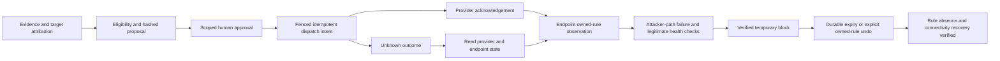

# Response and improvement toolkit contracts

The [response catalog](../src/terminus/toolkit/response_catalog.json) defines intended tools, connector prerequisites, specialty coverage and three core bundles. It does not install handlers, invoke providers, grant approvals, register future roles or change existing workflow behavior. The [PRD response requirements](PRD.md) and [future release boundary](FUTURE_SCOPE.md) remain authoritative.

All tools in this catalog are `implementation_pending` or `planned`. Existing evidence storage, containment guardrails, reports and action records are integration seams, not proof that these named tool adapters exist. A connector's `not_configured` status also remains explicit even when a related underlying client exists. Scenario A and B labs are not built by this change; Scenario B's vulnerability and response remain unselected.

## Core bundles and future specialties

| Core role | Intended bundle | Boundary |
|---|---|---|
| `response_planner` | Immutable evidence reads, citation validation, eligibility, proposal and plan review | Proposes actions; cannot approve or dispatch |
| `verification` | Immutable evidence reads, plan review, outcome evaluation and bounded independent lab observations | Reads observations; cannot change endpoint or provider state |
| `evidence_reporting` | Immutable evidence reads, citation validation, report draft and recorded-outcome review | Produces grounded local drafts; cannot close incidents, publish rules or export reports |

Each bundle has a maximum of 20 invocations. Each tool declares a one-hour maximum query window, page size 200, four pages, ten-second timeout and 65,536-byte output ceiling. These are contract ceilings to validate before adapter implementation, not measured throughput promises. Input-specific dispatch constraints must narrow them further; query-window limits do not define an action duration or approval lifetime.

Containment Planner and Remediation Planner map to `response_planner`; Recovery Verification Analyst maps to `verification`; Evidence Review Analyst and Incident Reporting Analyst map to `evidence_reporting`. These five aliases do not introduce new executable roles or specialized future tools. Detection Engineer and Defensive Control Validation Analyst remain future specialties, as do the other five dedicated response specialties. Their launch, assignment, scheduler admission and tool dispatch must be rejected in version 1.0. Future display metadata must stay outside the executable coordination catalog.

The two version 1.0 dispatch contracts, `response.wazuh_ip_block` and `recovery.wazuh_ip_unblock`, have empty `permitted_roles` and are absent from all agent bundles. A later trusted response service may implement them after the lab and acceptance gates are satisfied. Merely adding a catalog entry cannot make it callable.

## Tool and result boundaries

`evidence.get`, `evidence.timeline` and `evidence.validate_citations` refer to tenant/incident-scoped immutable evidence records. Preserve source timestamps, collection timestamps, IDs and hashes. Timelines disclose bounded pagination, truncation and collection gaps. A valid citation establishes that evidence exists in scope; it does not establish that the cited content supports an analyst's claim. Missing or stale evidence must remain visible.

Read queries must resolve resource identity inside the authenticated incident scope. Remote observations require an explicitly authorized connector, least-privilege organization credentials, egress policy and a permitted fixed observation. No catalog tool accepts an arbitrary shell command, script, URL, API method or wildcard fleet target. Controlled connectivity observations are declared lab checks, not attack generators.

Every tool result must distinguish unavailable, denied, failed and unknown states from successful observations. Include provenance, timestamps, resource identity, evidence references, pagination/truncation and actionable gaps. Label fixtures and simulations. Never substitute them for live results silently. Redact secrets before evidence persistence, logs, prompts or results.

## Immutable response proposal and approval

Before requesting approval, prepare a canonical proposal that binds:

- Organization, incident, task, connector connection and provider-native endpoint identity.
- Exact target, typed action, direction/protocol/ports or other narrowly defined parameters.
- Immutable source evidence IDs and hashes, attribution confidence, disputed evidence and unresolved prerequisites.
- Policy version, protected paths, allowlist snapshot, blast radius and legitimate-service impact.
- Approval expiration, effect duration/expiration, expected effect and independent verification predicates.
- Exact owned-resource undo or compensation scope, preservation requirements and irreversible consequences where undo is impossible.

Hash canonical UTF-8 JSON using stable key ordering and SHA-256. Store the immutable proposal and hash; the approval decision references that hash. A changed provider, endpoint, target, parameter, evidence basis, policy binding, duration or cleanup scope needs a new proposal and approval. An approval record is separate from dispatch intent, acknowledgement, execution evidence and verification.

Human approval is required for every consequential effect initially. An endpoint-generated request or model output cannot authorize itself. Check the approver's current organization membership and required role, and atomically reject expired or resolved decisions. Approval expiration, effect expiration and scheduler lease expiration are distinct clocks. The original approval may authorize narrowly scoped expiry cleanup; it does not authorize unrelated remediation or removal of another actor's rules.

## Dispatch, quotas and uncertain outcomes

A future shared response service must serve both workflow and specialist callers. Immediately before dispatch, recheck current permission, exact approved hash, endpoint/target identity, protected management hosts/IPs, Wazuh and Terminus infrastructure, excluded subnets, allowlist, durable quota, cancellation and worker ownership. Approval cannot override protected networks or the organization allowlist.

Commit an idempotent dispatch intent and its audit event before contacting a provider. The intent and authorization reservation must use transactional checks with the scheduler's live ownership fence. An action idempotency key binds the exact canonical request; reusing it with different parameters fails. A provider idempotency key or authoritative request lookup is required where available. A local transaction cannot promise exactly-once external effects.

Quota accounting must be organization-scoped and durable across restart and multiple processes. Define reservation, dispatch consumption and safely released pre-dispatch reservation semantics. Planning or an unconfigured tool must not consume an isolation quota. Check all affected resources and protected paths, including endpoint aliases and IPv6, rather than relying only on hostname substring matching.

Timeout, connection loss, worker death or ambiguous provider response after dispatch becomes an unknown outcome. Preserve the attempt, request ID and owned rule handle; hold dependent work. Read provider and endpoint state before retry or undo. Acknowledgement without endpoint observation remains acknowledgement. Missing authoritative state or conflicting observations remain unknown; a new worker cannot blindly replay the operation. Cancellation stops new effects but does not imply that an already dispatched effect disappeared.

Reconciliation records observed state and evidence under a current trusted service ownership check. Resume only the safe remaining stage; do not rerun an entire handler containing a completed or uncertain effect. A later response reconciliation/resume service is required; the existing help-request reconciliation path is not this service.

## Scenario A contract and independent checks

The first effect remains one narrow Wazuh-backed temporary attacker-IP block on the exact selected Linux endpoint. A plan must attribute the actual attacker IP from collected evidence and preserve management/service baselines. This document does not choose a Wazuh command, assume installed-version behavior or invent a provider acknowledgement.

Independent checks mean fresh observations attributable to a separate verification run/source, rather than the dispatch result repeated as evidence. Read the endpoint's actual owned rule; observe attacker-path failure from the authorized lab vantage; separately verify legitimate management and service health. The manager API's acknowledgement cannot satisfy these predicates. Missing checks produce pending, failed verification or unknown outcomes instead of `verified`.

Expiry and manual undo remove only the rule owned by the original attempt. Preserve preexisting rules and rules owned by other attempts. The expiry intent and cleanup progress survive application/worker restart. Reconcile uncertain dispatch or cleanup state before retry. Verify removal and recovery independently; do not label an expired timestamp as successful rollback. Failure of cleanup remains actionable and visible.

Scenario B cannot be finalized until its pinned lab vulnerability, harmless observable follow-on activity and response that interrupts that activity are selected. Reuse the same proposal, approval, dispatch, reconciliation and independent-health contract after that decision. A generic IP block must not be presented as a universal mitigation.

## Future effect families

| Family | Dedicated bounded contracts and risk requirements |
|---|---|
| Detection engineering | Versioned draft/backtest and separately approved publication; regression fixtures, deployment observations and rollback version |
| Malware and persistence eradication | Exact process start identity, file hash or persistence artifact version; evidence preservation; named quarantine/removal/restoration operations; recurrence and service checks |
| Identity response | Exact principal/session/credential reference; protected accounts and dependent services; distinguish reversible disablement from irreversible session revocation; never return credential values |
| Network blocking | Exact device and traffic tuple, versioned segmentation or DNS/proxy change; protected management paths; duration, owned undo and independent blocked/permitted-path observations |
| Backup and recovery | Read integrity and clean snapshot provenance first; scoped approved restore target with overwrite impact, preserved prior state and independent integrity/service checks |
| Deception | Authorized isolated decoy inventory/configuration, observation and separately approved deployment; isolation, expiry/removal ownership and attributable evidence |
| Defensive control validation | Read pinned control/test observations from an authorized environment; measured outcomes and legitimate health; no implied execution of adversarial tests |

Every future dispatch requires a human-approved exact proposal and durable idempotency. Future contracts neither authorize production use nor grant version 1.0 agents these tools. Cloud, container, application and other environment-specific response promotion also requires the corresponding area's typed resource contracts and connector verification; generic host tools do not establish that coverage.

## Existing code gaps before adapter activation

- [Workflow validation](../src/terminus/pipeline/validation.py) currently accepts a severity true edge as a containment gate. Consequential response needs mandatory scoped human approval at the shared runtime boundary.
- [Node schemas](../src/terminus/pipeline/nodes/schemas.py) define `timeout_seconds`, `target_agent_id` and `ip`; [workflow execution](../src/terminus/pipeline/workflow_engine.py) reads `timeout_minutes`, `hostname` and `ip_address`. Resolve and test schema/runtime parity before using these configuration values for effects.
- [Approval resolution](../src/terminus/storage/repositories.py) checks pending status without an atomic expiry condition. Existing workflow approvals bind a run/node rather than an immutable exact action proposal.
- [Action models](../src/terminus/orchestration/models.py) do not yet bind proposal/approval, action idempotency, provider identity, expiry or undo linkage. [Action transitions](../src/terminus/orchestration/storage.py) accept any nonempty verification outputs; they do not enforce independent evidence or scheduler ownership.
- [Containment quotas](../src/terminus/containment/guardrails.py) use process memory and have no production dispatch call site. Assessment TTL is metadata; no durable expiry/rollback service exists.
- [Scheduler storage](../src/terminus/orchestration/scheduler_store.py) conservatively holds uncertain effects and prevents unsafe automatic replay. A response-specific reconciliation/resume service still needs implementation.
- Workflow persistence failures are logged while traversal continues. Effects must fail closed if durable intent or authorization/audit cannot commit.
- [Active response](../src/terminus/containment/active_response.py) and workflow containment correctly return `not_configured` without execution. Preserve that behavior until a verified connector exists.

## Acceptance before real response

Validate catalog schema, unique IDs, reference integrity, exact twelve response specialties, the five approved core aliases and unavailable status. Ensure core bundles contain no dispatch or future tools; version 1.0 dispatch has no agent caller. Existing role/model authority cannot enlarge a bundle.

Adapter acceptance must prove schema/runtime target and timeout parity; tenant/incident isolation; missing/stale evidence handling; changed/expired/denied/wrong-role approvals; protected paths; durable quotas; duplicate/conflicting idempotency; concurrent/stale workers; persistence failure; cancellation; provider timeout; unknown-outcome reconciliation; restart recovery; owned-rule expiry/undo; and independent effect, service-health and recovery verification. API acknowledgement alone must fail the verification gate.

The live release gate remains three consecutive successful reset-and-run rehearsals for each mandatory scenario, plus denied approval, duplicate alert, provider timeout, missing connector, restart recovery and cross-tenant denial checks. Capture the real incident timeline, task tree, model provenance/usage, proposal/approval, connector evidence, independent verification and reset evidence. Fixture and scripted results do not satisfy live acceptance.
