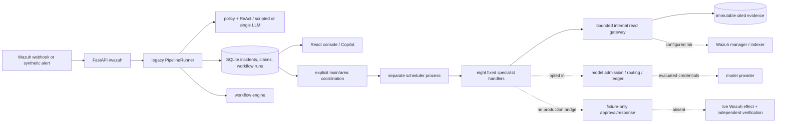

# TERMINUS AUDIT REPORT

> **Post-audit remediation, October 5:** The default offline verdict no longer invents attack counts or confidence; the Copilot model is limited to read-only tools and write tools have an admin guard; legacy connection checks no longer claim success without contacting a service; and the console marks planned containment and offline findings explicitly. A disposable synthetic API plus separate scheduler rehearsal persisted one cited triage record and surfaced missing Wazuh telemetry as incomplete. The original findings below describe the pulled baseline and remain as the audit record. See [Wednesday demo guide](../docs/PRESENTATION_DEMO_2026-10-07.md) for the verified walkthrough and open live-lab gates.

**Audit basis:** `3b7e16b` (`origin/main`, October 5, 2026), with the pre-existing local console edits preserved and rebuilt. This report evaluates the source and locally executable checks; it does not treat the attached audit brief or repository documentation as operational evidence. **Evidence scale:** E0 assertion, E1 inspected code, E2 isolated execution, E3 integrated synthetic execution, E4 lab live, E5 production representative. **State scale:** DOCUMENTED, CONTRACT ONLY, IMPLEMENTED, FIXTURE-TESTED, SYNTHETICALLY VERIFIED, LAB-LIVE VERIFIED, PRODUCTION VERIFIED. A row's state denotes the highest demonstrated state for that specific claim, not for a surrounding subsystem.

## 1. Executive Verdict

TERMINUS is currently an **AI-assisted investigation and orchestration workbench under development**, with a useful SQLite foundation, a bounded read-tool path, durable scheduling, model admission controls and an analyst console. It is not a demonstrated SOAR or autonomous defensive system. The strongest technical work is the newer incident-scoped, tenant-scoped scheduler/tool/evidence path. The weakest critical capability is the absent live chain from a Wazuh alert through an approved external effect and independent outcome verification.

The largest architecture risk is **two parallel trust paths**: the ordinary `/wazuh` ingestion flow still invokes the legacy `ReActAgent` and `ScriptedLlm`/single provider path, while the newer specialists, model gateway and evidence writer are separate. A user may see an incident without any specialist task. The largest safety risk is that the older path can present unsupported claims as high-confidence findings. In an E3 disposable API smoke test, a synthetic alert saying `single BRUTE login failed; no count supplied` returned HTTP 200, created one incident, logged the summary through `LogNotifier`, and asserted “45 failed authentication attempts within 60 seconds” with “high” confidence ([implementation](../src/terminus/llm/client.py), [pipeline selection](../src/terminus/server/deps.py)). The largest product risk is promising defense outcomes before any installed response adapter exists.

**Readiness:** useful pre-lab engineering prototype; unsuitable for production security decisions or autonomous response. Continue the direction, but narrow the first wedge to **source-linked alert investigation with explicit telemetry gaps**. Prove a single Wazuh SSH case before expanding agent roles or defensive breadth. A limited synthetic Gemini smoke test is recorded in [the checkpoint](../docs/PRELAB_IMPLEMENTATION.md), but I found no local lab or production evidence. The operational database and credentials were not used for this audit.

| Dimension | Score / 10 | Basis |
|---|---:|---|
| Product coherence | 5 | Clear investigation wedge diluted by SOAR/autonomy claims |
| Architecture | 6 | Strong newer boundaries; parallel legacy route |
| Reliability | 5 | Durable scheduler; full runtime and crash chain unproved |
| Security | 4 | Good new isolation controls; Copilot write authorization gap |
| AI grounding | 3 | Cited specialist contract; ordinary scripted verdict invents facts |
| Response safety | 3 | Strong fixture contracts; no live effect path |
| Analyst UX | 5 | Functional console; provenance and execution states need clearer separation |
| Observability | 5 | Durable jobs/invocations; missing end-to-end operational tracing |
| Test credibility | 6 | Extensive isolated coverage; little external effect evidence |
| Deployment readiness | 3 | One-host local setup; live source/response/restore gates open |

## 2. Current System Map

The API and optional scheduler are separate processes sharing one SQLite WAL file. The API starts process-local daily reporting and a workflow sweeper ([app](../src/terminus/server/app.py), [scheduler CLI](../src/terminus/orchestration/scheduler_cli.py)). Identity, sessions, incidents, tasks, runs, model configuration and gateway audit are durable; daily report history and campaign stitching are process-local ([dependency wiring](../src/terminus/server/deps.py), [stitcher](../src/terminus/correlation/stitcher.py)). Trust boundaries are browser/session to API, webhook source to tenant, source telemetry to evidence, model output to finding, and approval to external effect. The last boundary has only fixture execution. Wazuh manager/indexer, Jira, Slack/Twilio and model providers are optional external integrations; no live connection was established here.

## 3. Claim-to-Reality Matrix

| Claim | Source | Relevant Code | Relevant Tests | Live Evidence | Implementation State | Evidence Level | Verdict |
|---|---|---|---|---|---|---|---|
| Durable incident/task scheduling | [README](../README.md), [scheduler doc](../docs/SCHEDULER.md) | [scheduler/store](../src/terminus/orchestration/scheduler.py) | [scheduler tests](../tests/test_scheduler_runtime.py) | None here | FIXTURE-TESTED | E2 | Credible single-host foundation, no crash lab |
| Eight executable specialists | [README](../README.md) | [fixed plans](../src/terminus/orchestration/specialists/roles.py), [runtime](../src/terminus/orchestration/specialists/runtime.py) | [specialist tests](../tests/test_specialist_runtime.py) | Recorded one synthetic triage + Gemini run | SYNTHETICALLY VERIFIED for triage; FIXTURE-TESTED for seven others | E3/E2 | All handlers exist; most tool coverage absent |
| 60 specialties, 93 tools | [README](../README.md) | [catalogs](../src/terminus/toolkit/catalog.py) | [contract tests](../tests/test_toolkit_contracts.py) | None | CONTRACT ONLY | E2 | Display roadmap, not capacity |
| Source-linked immutable evidence | [README](../README.md) | [writer](../src/terminus/toolkit/evidence.py), [store](../src/terminus/orchestration/storage.py) | [evidence tests](../tests/test_toolkit_evidence.py) | One recorded synthetic triage citation | SYNTHETICALLY VERIFIED for narrow path | E3 | Strong narrow path; ordinary verdict bypasses it |
| Safe model gateway | [README](../README.md) | [admission](../src/terminus/model_gateway/admission.py), [routing](../src/terminus/model_gateway/routing.py) | [gateway tests](../tests/test_model_admission.py) | Recorded limited Gemini synthetic call only | SYNTHETICALLY VERIFIED for that call | E3 | Useful controls; not governing legacy path |
| Real Wazuh ingestion | [release scope](../docs/MVP_RELEASE.md) | [webhook](../src/terminus/server/routers.py), [client](../src/terminus/siem/wazuh.py) | [server tests](../tests/test_server.py) | No authenticated Wazuh source observed | FIXTURE-TESTED | E2 | Source credential and lab proof missing |
| Approved live IP block | [PRD](../docs/PRD.md) | [fixture response](../src/terminus/response/fixtures.py), [incident action](../src/terminus/server/routers.py) | [response tests](../tests/test_response_lifecycle.py) | None | FIXTURE-TESTED | E2 | Endpoint returns 501 for live block |
| Independent outcome verification | [release scope](../docs/MVP_RELEASE.md) | [fixture verification](../src/terminus/response/fixtures.py) | [response tests](../tests/test_response_lifecycle.py) | None | FIXTURE-TESTED | E2 | Test observations only |
| Multi-tenant security | [app metadata](../src/terminus/server/app.py) | [membership](../src/terminus/server/deps.py), [Copilot tools](../src/terminus/server/copilot_tools.py) | [org tests](../tests/test_durable_orgs.py) | None | FIXTURE-TESTED | E2 | Tenant lookups strong; write-role gap remains |
| “Autonomous” investigation | [package metadata](../pyproject.toml), [Copilot prompt](../src/terminus/server/copilot.py) | [legacy agent](../src/terminus/agent/react_agent.py) | [agent tests](../tests/test_investigator.py) | No quality study | IMPLEMENTED | E1/E2 | Overstates grounded autonomy |
| Protected asset inventory | UI/README | [asset API](../src/terminus/server/assets_api.py) | [asset tests](../tests/test_assets.py) | None | FIXTURE-TESTED | E2 | Registration is inventory, not protection |

**Overclaims:** Replace “Autonomous Incident Response” in [package metadata](../pyproject.toml) with “AI-assisted security investigation workspace”; replace the global Copilot’s “immediate investigation and containment workflows” and “active containment” in [its fixed platform prompt](../src/terminus/server/copilot.py) with “incident investigation and response planning; live containment unavailable until an installed connector is verified.” Replace “verified resolutions” with “analyst-recorded dispositions.” **Underclaims:** [README](../README.md) says live specialist handlers remain release work, but eight executable fixed-plan handlers are present; say “handlers implemented and fixture-tested; only triage has recorded synthetic integrated execution.” **Ambiguity:** “immutable evidence” applies to canonical orchestration evidence, not every legacy incident summary or user note.

## 4. Product Identity

**Current product category:** AI-assisted investigation workspace plus security automation framework. **Recommended category:** evidence-first SOC investigation workbench. **Current wedge:** broad incident/agent/workflow/response console. **Recommended wedge:** one Wazuh alert to cited, gap-aware analyst decision. **Primary buyer:** small SOC or MDR engineering lead with Wazuh already deployed. **Primary daily user:** triage analyst. **Core differentiated workflow:** open an alert, inspect original event and related source records, see supported findings and missing collection, decide next action with a reproducible audit trail.

TERMINUS should augment the SIEM/EDR and existing response control, not replace them. An analyst opens it when it reliably cuts the time from alert to an evidence-supported decision; no measured time saving is available yet. The shortest path needs authenticated source ingestion, bounded retrieval, cited findings, explicit gaps and a simple dossier. Five areas and response machinery are secondary until that path works against real telemetry.

## 5. End-to-End Trace

Representative path: synthetic or operator-submitted `SiemAlert` → authenticated `/wazuh` → `PipelineRunner.process_alert` → `PolicyEngine` → legacy investigation → SQLite incident → optional first matching workflow → notification/graph/claim update → UI. The separate coordination path requires explicit task admission and a running scheduler. It is not automatically proven by incident creation. [Router](../src/terminus/server/routers.py), [runner](../src/terminus/pipeline/runner.py), [dependency composition](../src/terminus/server/deps.py).

| Transition | Persistence / boundary | Retry, loss, duplicate or trust concern |
|---|---|---|
| Source → API | Pydantic alert; human session selects org | No source-bound Wazuh credential/replay proof; malformed input rejects |
| API → claim | Org + alert-ID claim in SQLite | Duplicate ID held; caller needs a stable authentic source ID |
| Claim → policy/correlation | Policy is deterministic; campaign state in RAM | Restart changes campaign grouping; suppression observability is limited |
| Policy → verdict | Legacy `ReActAgent`; optional model, default scripted | Scripted facts can exceed evidence; prompt wrapping is wording, not semantic proof |
| Verdict → incident | Canonical SQLite ticket before workflow | Legacy summary may be mistaken for source evidence; incident and claim update span separate steps |
| Incident → workflow | First enabled match; workflow run stored | Workflow selection errors are logged and skipped; some downstream errors are swallowed |
| Workflow → specialist | Explicit bridge/task/scheduler path only | Missing scheduler/connector yields task gaps; do not infer execution from ticket |
| Tool → evidence → model | Fenced read writer; evidence IDs; model classifications | Narrow new path has scoped provenance; citation ID alone does not prove claim semantics |
| Proposal → approval → effect | Private fixture contracts only | Live API rejects block/isolate; no lab effect, reconciliation or independent outcome |
| Report/UI | Incident/status and task activity views | Status describes application record, not defended endpoint |

The most important consistency window is incident creation before final claim/report update; a crash can leave a ticket while the alert claim lacks a completed report. The workflow query catches exceptions and proceeds, so workflow absence may look like normal completion ([runner](../src/terminus/pipeline/runner.py)). Composite organization keys and membership checks are a solid default, but all new integration code must preserve them.

## 6. Architecture Findings

**Orchestration.** The scheduler uses a single coordinator lease, task fencing, bounded workers, retry budgets and conservative waits for uncertain action history ([runtime](../src/terminus/orchestration/scheduler.py), [store](../src/terminus/orchestration/scheduler_store.py)). It gives credible E2 safety for recorded actions, not exactly-once external effects. Missing evidence: kill process before/after real dispatch, late provider success, disk full, busy database and adapter reconciliation. Poison work should expose age/owner and a manual resolution queue.

**SQLite.** WAL, foreign keys, 5-second busy timeout and transactional `BEGIN IMMEDIATE` are appropriate for one host and bounded workers ([database](../src/terminus/storage/db.py)). SQLite is sufficient until measured p95 write latency exceeds 250 ms or busy errors exceed 0.1% during a representative week, checkpoint/backup falls behind retention needs, or a second host must write. It becomes risky with long write transactions, multi-host scheduling, unattended WAL growth or untested restore. The migration trigger should be one of those measured conditions, not “enterprise scale.” Preserve repository interfaces, composite tenant keys and transaction ownership. No alert/day, write throughput, database growth or live-backup benchmark was available; capacity claims are **unverified**.

**Agents.** Eight real handlers and fixed read plans exist; several planned tools deliberately yield `tool_not_installed` ([role plans](../src/terminus/orchestration/specialists/roles.py)). Triage has the best current path. Identity/endpoint/network/application can produce useful observed records only when corresponding readers and telemetry are installed. Response planner, verifier and reporting currently lack executable live response/verification tools. Five logical areas do not require five model calls, but add coordination state. Compare alternatives with a scenario benchmark: A one investigator + tools has lowest cost/latency, B planner + specialist calls adds selective depth, C triage→investigator→planner→verifier is suitable for consequential response, D current eight roles is justified only if quality improves enough to offset extra latency and gaps. Start with A for investigation and C for the later response proof.

| Specialist | Real handler? | Model? | Tools/inputs | Output/evidence/verification | Current value |
|---|---|---|---|---|---|
| Triage | Yes | Optional routed model | Incident, alert search, coverage | Cited finding or gap; one recorded synthetic integrated run | Highest, still no live lab |
| Identity | Yes | Optional | Incident, auth events, coverage | Cited result/gap; fixture tests | Potential, installed connector required |
| Endpoint | Yes | Optional | Incident, endpoint agent, alerts, coverage | Cited result/gap; fixture tests | Potential, installed connector required |
| Network | Yes | Optional | Incident, alerts, coverage, connections, DNS | Cited result/gap; catalog gaps expected | Limited today |
| Application/API | Yes | Optional | Incident, requests, inventory, alerts | Cited result/gap; catalog gaps expected | Limited today |
| Response planner | Yes | Optional | Timeline, citation check, eligibility | No live proposal tool installed | Fixture planning only |
| Verification | Yes | Optional | Timeline, citation check, evaluate | No live effect/health observations | Fixture only |
| Evidence/reporting | Yes | Optional | Timeline, citation check, draft | No complete live case record | Useful presentation layer after collection |

**Model gateway/toolkit.** Named AES-GCM credentials with externally supplied key, tenant binding, grants, classification, budget reservation, routing and pinned transport are meaningful controls ([cipher](../src/terminus/model_gateway/secrets.py), [admission](../src/terminus/model_gateway/admission.py)). The internal gateway fixes tool selection in code, bounds requests/results and writes invocation-linked evidence ([gateway](../src/terminus/toolkit/gateway.py)). These controls do not cover legacy `OpenAiCompatibleLlm` or Copilot. The 60-role catalog should remain unavailable in execution. Live adapter behavior beyond the recorded Gemini smoke test is **not verified**.

**Correlation/response.** Campaign stitching is per process and keyed by org/host/source; it is not durable case correlation ([stitcher](../src/terminus/correlation/stitcher.py)). Response policy, exact approval digest, intent-before-I/O, reconciliation, observations and owned-resource undo are well-designed fixture contracts ([service](../src/terminus/response/service.py), [fixtures](../src/terminus/response/fixtures.py)). Their next use must be an installed Wazuh adapter, not a UI relabel.

## 7. AI & Agent Findings

The new specialist result requires evidence IDs and drops findings citing IDs outside the sent set ([runtime](../src/terminus/orchestration/specialists/runtime.py)). This blocks one form of fabricated citation. It does not check that cited source text semantically supports the claim. The older default scripted path directly invents quantities, host impact and recommended actions from keywords ([scripted model](../src/terminus/llm/client.py)). The older prompt includes untrusted log content; sanitization and wrapping lower risk but cannot establish that telemetry is never followed as instruction ([ReAct path](../src/terminus/agent/react_agent.py)). The new model is given no tool declarations and cannot choose read scope, a better structural boundary.

Run five blinded defensive cases before quality claims: encoded PowerShell with parent/child telemetry, compromised identity with missing MFA logs, web probe with no exploit confirmation, lateral movement with partial host coverage, and a benign high-level maintenance event. Score correct observed facts, unsupported claims, uncertainty, analyst decision quality, time and cost. For injection, place commands in filename/log/HTTP fields and require no change in tools, scope, approval or verdict without source support. Existing [evaluation cases](../src/terminus/model_gateway/evaluation_cases.py) are contract fixtures; full provider/model evaluation and live telemetry are missing. No measured specialist-vs-single-agent lift exists.

## 8. Security Findings

Auth uses durable hashed sessions and current membership checks for tenant selection ([auth](../src/terminus/auth/service.py), [deps](../src/terminus/server/deps.py)). New model secrets use AEAD and an external key; legacy credentials remain ordinary environment settings. The critical authorization gap is the Copilot: both chat routes require a current organization but not `require_operator`; `IncidentTools.execute` can create/update agents/workflows and add an allowlist entry without the current actor/role, and validates workflow input with literal `caller_role="admin"` ([chat routes](../src/terminus/server/copilot.py), [write tools](../src/terminus/server/copilot_tools.py)). Thus a viewer with a configured tool-capable model can reach write-capable logic. The scope is organization-local, but it violates role separation. Reproduce with a viewer, a deterministic tool-calling stub and a workflow write before release; block writes at tool dispatch using server-derived actor permission. Public demo routes are local-only after recent fixes. The Wazuh webhook currently requires a human operator session and uses that person's org; provision a distinct, tenant-bound source credential with replay protection ([webhook](../src/terminus/server/routers.py)). API request body limits, rate limits, session/CSRF posture and secret-safe logs need a deployment-level adversarial test before exposure.

## 9. Response Safety Findings

The fixture proposal binds policy/provider/target/parameter evidence and expiry; approval is by a distinct current administrator; unique intent precedes simulated effect; interrupted effects wait for reconciliation; verification needs separate observations; undo removes only owned resources ([response service](../src/terminus/response/service.py), [fixture driver](../src/terminus/response/fixtures.py)). This is **E2, fixture-only**. The ordinary incident API returns HTTP 501 for `block_ip` and `isolate_host` ([action route](../src/terminus/server/routers.py)). No live blast-radius check, Wazuh block receipt, effect read-back, attacker-path test, legitimate management check or real expiry was demonstrated. Do not treat “approved,” “dispatched,” “acknowledged,” “effect observed” and “threat contained” as synonyms.

## 10. UI / Analyst Workflow Findings

The console has incident queue/dossier, activity, agents, workflows, reports, assets and model settings. Local browser fixture checks cover role visibility, organization switching and synthetic alert submission, but mock API responses ([Playwright tests](../web/e2e/)). The action badge now distinguishes `APPROVED` from `SUCCESS` ([workbench](../web/src/views/workbench.tsx)). The dossier still says “timestamps verified directly against the incident database record,” which establishes record display, not source clock accuracy. The primary decision view should show original alert, source time vs collected time, cited related observations, collection gaps, model hypotheses, analyst assertions and outcome state on one screen. Each incident needs a prominent synthetic/replayed/live-source label and last collection time. Registered assets must say “inventory only” until verified coverage exists.

## 11. Test & Verification Findings

The suite is mostly unit, contract, repository and synthetic integration checks. The browser tests use fixture APIs. Scheduler and response tests cover valuable fencing/uncertain outcomes but cannot prove a Wazuh effect. A limited Gemini synthetic call is documented; no E4 Wazuh, response, undo or service-health result was available. The smallest missing set is: (1) authenticated Wazuh source ingest with duplicate/replay/failure, (2) one real retrieval plus cited finding and no invented fact, (3) viewer Copilot write denial, (4) process death after lab effect before receipt persistence, (5) exact-action approval mutation/staleness, (6) independent attack-path and management-health verification plus undo.

**Local verification on this checkout:** locked dependency sync passed; initial test collection failed because the old local virtual environment lacked newly required `cryptography`. After sync, the full backend run completed **1,126 passed, 1 failed** in 427.26 seconds. The failing assertion expected dotted IPv4 notation for an IPv6-mapped private address, while the verifier intentionally canonicalizes addresses. I corrected the expectation in [the test](../tests/test_model_data_safety.py); its focused file then passed **19/19**, and Ruff passed. I did not repeat the seven-minute full suite for this representation-only test correction. The frontend build passed, and Playwright fixture tests passed **8/8**. A disposable, offline FastAPI session also passed register/login/org creation, synthetic `/wazuh` ingestion and incident listing, while exposing F01. These outcomes establish local software checks, not live security effects.

## 12. Performance & Cost

The production console built successfully (3,346 modules transformed; Vite 14.73 seconds, TypeScript/Vite command 21.83 seconds on this machine). Eight Playwright browser fixture checks passed in 41.2 seconds. No representative alert-to-decision timing, SQLite write-latency curve or 1,000-incident model bill was recorded. The synthetic specialist example in [pre-lab checkpoint](../docs/PRELAB_IMPLEMENTATION.md) used one Gemini call with 685 input + 83 output tokens for a partial result; it is one sample, not a distribution. Cost per investigation = sum of provider-reported input/output tokens × versioned configured rates plus retry/ambiguous exposure; cost per 1,000 requires a measured call distribution and failed-call rate. A free-tier rate stored as zero does not establish future marginal cost. Limit context duplication by executing specialists only when their tool coverage and expected independent evidence justify them.

## 13. Documentation / Claim Findings

| Topic | Document A says | Document B says | Code says | Recommendation |
|---|---|---|---|---|
| Specialist availability | [README](../README.md): live handlers remain release work | [pre-lab](../docs/PRELAB_IMPLEMENTATION.md): one integrated synthetic triage run | Eight fixed handlers are present, connectors optional | Say “implemented handlers; one synthetic integrated triage; lab unverified” |
| Model support | [M02 doc](../docs/MODEL_ADAPTERS.md): fixture adapters | [pre-lab](../docs/PRELAB_IMPLEMENTATION.md): production transport + Gemini smoke | New transport exists; legacy direct path remains | Date each checkpoint and show per-path validation |
| Response | [PRD](../docs/PRD.md): approved verified defense release requirement | [response doc](../docs/RESPONSE_LIFECYCLE.md): fixture-only | No live response route/adapter | Keep release aspiration separate from current capability |
| Wazuh | [README](../README.md): oriented around Wazuh | [architecture decisions](../docs/ARCHITECTURE_DECISIONS.md): source auth gap | Human-session webhook, limited client | Publish exact inbound/outbound contracts |
| Autonomy | [package metadata](../pyproject.toml): autonomous response | [MVP](../docs/MVP_RELEASE.md): human approval | Only fixture response | Remove autonomous response wording now |
| Architecture decisions | Earlier sections say model store/transport pending | Later appendices say implemented | New modules exist | Convert chronology to one current-state table |

## 14. Failure Matrix

| Failure | Current Behavior | Risk | Desired Behavior | Priority |
|---|---|---|---|---|
| SQLite unavailable | API/scheduler operations fail | Paused intake and work; possible source retry | Health degraded, intake retry contract, no false success | P1 |
| SQLite locked | 5s busy timeout | Delay/rejected writes | Metrics, bounded retry, no unsafe replay | P2 |
| Disk full | Not lab-tested | Commit/audit loss | Fail closed, alert operator, restore drill | P1 |
| Provider unavailable/429 | New gateway bounded admission; legacy fallback | Partial answer or scripted overclaim | Explicit model unavailable; preserve evidence | P1 |
| Invalid model JSON | New result validation; legacy fallback | Invented verdict on fallback | Mark unsupported/partial | P1 |
| Wazuh unavailable | New readers yield gaps; legacy client may return `unknown` | Missing context mistaken for clean | Typed connector failure and staleness | P1 |
| Network partition/late success | Scheduler holds prior recorded dispatch | Duplicate effect if adapter bypasses intent | Persist intent, reconcile by independent read | P1 |
| Worker crash | Expired lease recovery | Repeat uncertain action | Keep consequential work waiting | P1 |
| API crash | SQLite state survives; RAM reports/campaigns lost | Inconsistent analyst history | Durable reports/correlation and replay | P2 |
| Frontend stale/SSE disconnect | Fetch/fixture paths exist | Stale decision | Last-updated and reconnect state | P2 |
| Scheduler stopped | Tasks remain queued | Silent no-investigation | Queue-age/heartbeat alert | P1 |
| Notification failure | Logged and pipeline proceeds | Missed escalation | Durable outbox and analyst-visible failure | P2 |
| Tool timeout/partial success | Gateway returns bounded failure/partial | Incomplete evidence | Show precise gap and preserve provenance | P2 |
| Corrupt evidence | Hash checks in new path | Wrong/hidden fact | Quarantine, alert, no model admission | P1 |
| Missing telemetry | New specialist gap; legacy scripted answer may not | False certainty | Insufficient-telemetry outcome | P1 |
| Expired credentials | New transport denies; legacy Wazuh cached JWT lacks refresh | Lost retrieval | Typed auth failure, safe refresh/rotation | P2 |
| Clock skew | Time windows and expiry use wall time | Missed evidence/stale approval | Clock monitoring, bounded skew tests | P2 |

## 15. Full Finding Register

| ID | Severity | Finding | Evidence | Impact | Fix | Effort | Confidence |
|---|---|---|---|---|---|---|---|
| F01 | P1 | Default scripted verdict invents “45 in 60s” from one failure | E3 disposable `/wazuh` → incident reproduction; [code](../src/terminus/llm/client.py) | Misleads triage | Remove scripted forensic assertions; label demo; require cited facts | M | High |
| F02 | P1 | Copilot can reach write tools without actor role check | E1 [route](../src/terminus/server/copilot.py), [executor](../src/terminus/server/copilot_tools.py) | Viewer may change org configuration | Server-derived role at every write dispatch; negative test | M | High |
| F03 | P1 | Human-session webhook lacks source-bound Wazuh credential | E1 [route](../src/terminus/server/routers.py), [deps](../src/terminus/server/deps.py) | Source spoofing/operational integration gap | Dedicated tenant-bound credential, replay/idempotency checks | M | High |
| F04 | P1 | Legacy ingress bypasses new grounding/model admission | E1 [composition](../src/terminus/server/deps.py), [runner](../src/terminus/pipeline/runner.py) | Inconsistent safety and product claims | Route to one cited investigation contract | L | High |
| F05 | P1 | Live response and independent verification absent | E1 [501 route](../src/terminus/server/routers.py), [fixture](../src/terminus/response/fixtures.py) | No closed-loop defense | One lab adapter and independent observations | L | High |
| F06 | P2 | Campaign state and daily report history process-local | E1 [stitcher](../src/terminus/correlation/stitcher.py), [app](../src/terminus/server/app.py) | Restart changes history | Persist or clearly label ephemeral data | M | High |
| F07 | P2 | Workflow selection failure is logged then skipped | E1 [runner](../src/terminus/pipeline/runner.py) | Workflow miss can look normal | Persist degraded processing state and retry policy | S | High |
| F08 | P2 | Several specialist plans reference uninstalled tools | E1 [plans](../src/terminus/orchestration/specialists/roles.py) | Eight-role UI overstates coverage | Show per-role available tools; gate assignment | S | High |
| F09 | P2 | Historical architecture text contradicts current code | E0/E1 [decisions](../docs/ARCHITECTURE_DECISIONS.md) | Review/buyer confusion | Current-state ledger with dated history | S | High |
| F10 | P2 | No measured single-host capacity, backup/restore or latency | E0 [release targets](../docs/PRD.md) | Unknown operating limit | Representative load and restore drill | M | High |

No P0 is assigned: the strongest unsafe pathways found here lack demonstrated cross-tenant access, secret compromise or live consequential effect. F01 and F02 are release-blocking P1 findings.

## 16. Keep / Change / Remove

### Keep

Single-host SQLite for the first deployment, composite tenant keys, fenced scheduler and conservative uncertain-action handling; invocation-linked evidence with separate source/collection times; exact-action approval fixture design; explicit connector gaps and default local-only model evidence.

### Change

Unify ordinary ingress with the new cited investigation contract. Enforce role checks inside Copilot tool execution. Make source authenticity and source freshness visible. Gate specialist assignment by installed capability. Turn response fixtures into one least-privileged lab adapter after negative-case tests. Persist operational report/correlation records needed across restart.

### Remove

The default scripted model's forensic fact claims, unqualified “autonomous response” wording, and catalog-as-capability UI. Defer 60 specialty activation, multi-host database migration, extra model layers and new defense actions until the first end-to-end proof.

## 17. Recommended Target Architecture

One API process group on one host accepts a tenant-bound Wazuh source credential, validates/replay-checks the alert and commits an intake record. One SQLite database holds incidents, source envelopes, tasks, evidence, model admission/audit, approvals, response intents and an outbox. One dedicated scheduler owns bounded investigations and response reconciliation. A single investigator uses fixed, permissioned readers; it stores raw/normalized observations distinctly from derived facts and model hypotheses. A model may produce a typed, citation-checked draft, never change tool scope or policy. The analyst reviews one dossier and approves a canonical digest of the exact reversible action. A least-privileged adapter persists intent before dispatch, reconciles provider effect, and an independent read path tests attacker path plus service/management health. Expiry/undo is a durable job; every state is separately visible. Keep the current repository boundaries where they enforce these rules; collapse legacy parallel LLM and scripted verdict paths into this flow.

## 18. Closed-Loop Defense Readiness

| Chain link | State | Required next proof |
|---|---|---|
| Authentic real alert | UNVERIFIED | Wazuh source credential + original lab event |
| Intake/normalization/persistence | PARTIAL | Real source replay and restart check |
| Incident/queue | READY for synthetic | Real alert-to-incident timing |
| Specialist read/evidence | PARTIAL | Installed Wazuh read with source timestamps |
| Grounded finding | PARTIAL | Blind cases and semantic citation review |
| Scoped proposal | PARTIAL | Production bridge from findings to fixture contract |
| Human exact approval | PARTIAL | UI/API wired to digest, stale mutation test |
| Live dispatch/reconciliation | MISSING | One Wazuh lab effect, crash/timeout recovery |
| Independent effect/outcome/health | MISSING | Attack path + management check |
| Expiry/undo | MISSING live | Owned-resource lab reset |
| Complete audit/report | PARTIAL | Joined end-to-end trace and durable report |

## 19. Prioritized Refinement Roadmap

| Phase | Exact goal and likely modules | Acceptance criteria / required tests | Evidence | Dependency | Effort |
|---|---|---|---|---|---|
| 0 Truth & Safety | Remove invented scripted findings and inaccurate Copilot/metadata claims; guard Copilot writes in `llm/client.py`, `server/copilot*.py`, `pyproject.toml`, UI | One-login fixture cannot claim count; viewer tool-call write returns denial; claim review | E2 | None | M |
| 0 Truth & Safety | Source-bound authenticated ingest in `server/routers.py`, `deps.py`, `storage/*` | Wrong tenant, replay, malformed and expired credential rejected; one stable event ID | E3 | Tenant key design | M |
| 1 Prove Investigation | One Wazuh SSH read path and one cited dossier in `pipeline/runner.py`, `toolkit/wazuh_readers.py`, `specialists/*`, `web/src/views/workbench.tsx` | Original and related events shown with timestamps, gaps; process restart preserves case; no uncited observed facts | E4 | Source auth + lab | L |
| 1 Prove Investigation | Blind five-case evaluation in `model_gateway/evaluation*.py` | ≥95% source-supported factual claims, zero fabricated high-impact facts, explicit missing-data outcomes; compare single investigator vs roles | E4 | Lab telemetry | M |
| 2 Prove Controlled Response | Install least-privileged temporary Wazuh IP block and bind review UI to `response/service.py` | Exact digest/expiry, no self-approval, stale mutation denial, idempotent intent; late success and crash tests | E4 | Phase 1 + target policy | L |
| 3 Prove Verification | Independent Wazuh/target read-back plus attacker/management/service checks and undo in `response/*` | Provider ack alone stays pending; attack blocked, legitimate management healthy, expiry removes only owned rule | E4 | Phase 2 | L |
| 4 Productize | Durable report/outbox, queue/connector metrics, backup/restore and load in `reports/*`, `pipeline/*`, `server/*`, `storage/*` | Restore from live backup; p95 thresholds and alerting met under measured target workload | E5 | Phases 1–3 | L |
| 5 Expand | Add roles/integrations only after measured benefit | New role improves blinded decision accuracy/time enough to justify cost; isolated tool safety tests | E4/E5 | Phase 4 | M per role |

## 20. Top 10 Next Engineering Tasks

1. Replace `ScriptedLlm` forensic branches with a clearly labeled demonstration result that never asserts an event count or compromise absent in the input; add the one-login regression.
2. Pass the authenticated actor/role into `IncidentTools`; deny create/update workflow/agent and allowlist writes to viewers and require an explicit analyst confirmation for model-proposed writes.
3. Add a Wazuh webhook credential bound server-side to one organization and integration; reject replayed source event IDs and separate sample-submit from source ingest.
4. Persist a typed intake envelope with raw source timestamp, collection timestamp, source ID, org ID, hash and normalization status before investigation.
5. Replace the legacy verdict handoff in `PipelineRunner` with an `InvestigationFinding` contract separating observed facts, deterministic derivations, model hypotheses and gaps; require evidence IDs for every observed fact.
6. Wire one endpoint and authentication reader to a controlled Wazuh manager/indexer; surface `connector_not_configured`, auth failure and stale collection distinctly.
7. Make workflow selection/dispatch errors durable incident processing states; never mark a skipped required workflow as handled.
8. Bind response approval to canonical org/action/target/parameters/policy version/expiry digest in the actual API/UI path; add stale approval and argument mutation tests.
9. Implement one idempotent, reversible Wazuh lab IP-block adapter with persisted intent, receipt lookup and ambiguous-timeout reconciliation; no blind retry.
10. Add independent attacker-path, endpoint effect and protected management/service probes, plus owned-rule expiry/undo and a complete audit trace for the same incident.

## 21. Demo That Proves TERMINUS

In an isolated, resettable Kali → Ubuntu → Wazuh lab, generate an actual SSH password-guessing sequence. Show Wazuh's original event and its authenticated arrival, the committed incident, a triage task and bounded identity/endpoint reads with source-linked timestamps. Display missing telemetry honestly. Have a model produce only cited hypotheses and an analyst inspect exact IP/host/scope/exclusions/expiry. The analyst approves a digest-bound temporary block. Show the live Wazuh command and receipt, then separately prove attacker SSH fails while management SSH and application health remain good. Restart the API/scheduler after dispatch but before recording completion; reconcile without duplicate block. Let the rule expire or undo it, prove access returns, and display the complete audit trail. Mark any replayed alert, fixture specialist, simulated observation or recorded video as such. Today only the software fixture portions and a limited synthetic model call have evidence; the lab effect is **not verified**.

## 22. Production Readiness Gate

### AI-assisted SOC workspace

At least one real source authenticates per tenant; ≥95% of factual claims in blinded cases are source-supported, zero material fabricated facts, original evidence is inspectable, and missing telemetry is explicit. Analysts can complete and reproduce the decision workflow.

### Semi-autonomous SOC analyst

The workspace meets the prior gate plus durable unattended triage on a representative alert mix, measured accuracy/latency/cost against a human baseline, bounded failures/retries and complete task provenance. Human review remains required for consequential effects.

### Autonomous defensive response

Do not claim this until multiple reversible real actions pass exact-policy, blast-radius, independent effect and service-health checks, ambiguous-dispatch reconciliation, undo and adverse-event drills under a separately approved risk envelope. The current product has no such evidence.

### Production-ready

Pass tenant isolation and authorization penetration tests, documented restore and key rotation drills, representative load/SLO tests, connector monitoring, incident response runbooks, secure source authentication and the complete E5 defense or investigation scope being sold. State the exact supported deployment topology and integration versions.

## 23. Final Recommendation

**Continue**, but sell and build the next release as a trustworthy Wazuh investigation workbench. Stop presenting the catalog, fixture response and legacy scripted verdict as autonomous defense. The strongest potential moat is a reproducible chain from source observation to bounded AI-assisted finding to exact human decision and independently checked outcome. The single most important proof is **one real Wazuh SSH alert that yields a cited investigation and a reversible, approved, independently verified lab block without losing analyst trust after failure or restart**.
